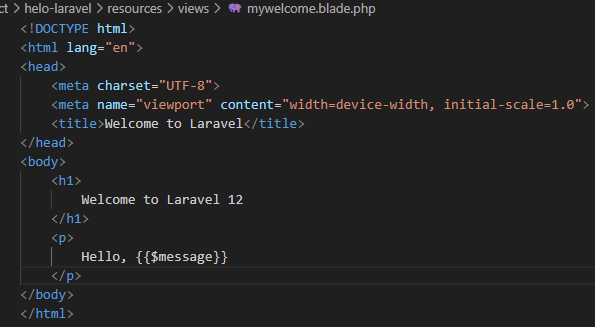
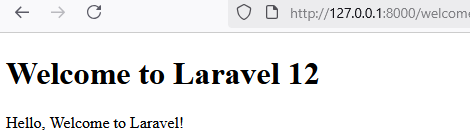

**Laporan Modul 2: Laravel Fundamentasl**
**Mata Kuliah:** Workshop Web Lanjut   
**Nama:** [Lediana Berasa]  
**NIM:** [2024573010034]  
**Kelas:** [TI2C]  

---

## Abstrak 

Laporan praktikum ini membahas penerapan dasar framework Laravel berfokus pada konsep Routing, Controller, dan View menggunakan Blade Templating Engine. Tujuan utamanya adalah untuk memahami pola arsitektur Model-View-Controller (MVC) dalam Laravel serta mekanisme penanganan request dan response. Metode yang digunakan dalam praktikum ini meliputi pembuatan route, controller, dan view sederhana, serta pengembangan sebuah aplikasi kalkulator berbasis web. Hasil praktikum menunjukkan pemahaman yang baik tentang alur kerja Laravel dan kemampuan dalam mengimplementasikan konsep MVC untuk membangun aplikasi web yang terstruktur dan modular.

---

## 1. Dasar Teori
- Apa itu MVC (Model, View, Controller). MVC adalah pola desain perangkat lunak yang membagi aplikasi menjadi tiga komponen utama untuk pemisahan tugas: **Model:** Mengelola data, logika bisnis, dan berinteraksi dengan database. 
**View:** Bertanggung jawab untuk menampilkan data kepada pengguna.**Controller:** Berfungsi sebagai penghubung antara Model dan View, memproses input pengguna, dan menentukan respons yang akan diberikan. 
- Konsep Routing di Laravel.
  Routing di Laravel adalah proses menentukan bagaimana request pengguna akan ditangani. Saat pengguna mengakses URL tertentu, Laravel akan mencocokkannya dengan definisi route di file routes/web.php. Rute ini kemudian akan mengarahkan request ke Controller yang sesuai, yang akan mengeksekusi logika yang diperlukan. 
- Fungsi Middleware.
  Middleware adalah lapisan yang menyaring request HTTP sebelum mencapai controller. Fungsinya adalah untuk menjalankan tugas sebelum atau sesudah sebuah request diterima, seperti otentikasi pengguna, verifikasi izin, atau modifikasi request. 
- Bagaimana cara Laravel menangani Request dan Response.
    1. Request: Pengguna mengirimkan request (permintaan) ke aplikasi melalui URL. 
    2. Routing: Laravel menggunakan routing untuk mengidentifikasi controller yang akan menangani request tersebut. 
    3. Middleware: Middleware mungkin akan memproses request sebelum mencapai controller, seperti memeriksa login. 
    4. Controller: Controller menerima request, berinteraksi dengan Model (jika perlu untuk mengambil data dari database), dan kemudian mengirimkan data yang diperlukan ke View. 
    5. View: Controller meneruskan data ke View, yang kemudian dirender (diubah) menjadi HTML untuk ditampilkan kepada pengguna. 
    6. Response: HTML yang dihasilkan kemudian dikirim kembali ke pengguna sebagai response. 
- Peran Controller dan View.
    1. Controller: Bertindak sebagai mediator antara Model dan View. Controller menerima request dari pengguna, memprosesnya, dan menentukan data apa yang akan dikirimkan ke View. Controller juga dapat mengirimkan view secara langsung tanpa Model, atau mengirimkan data ke view tanpa memprosesnya lagi.
    2. View: Bertanggung jawab untuk menyajikan data dari Controller ke pengguna. View adalah antarmuka yang dilihat pengguna, seperti halaman HTML.
- Fungsi Blade Templating Engine.
Blade adalah mesin templating yang digunakan di Laravel untuk membuat View yang dinamis. Fungsinya meliputi: 
**Sintaks** yang Mudah Dikelola: Memungkinkan penulisan kode tampilan yang lebih bersih dan efisien.
**Inheritance:** Memungkinkan pembuatan layout induk yang dapat diwarisi oleh view lain, mengurangi duplikasi kode.
**Data Presentation:** Memudahkan pengiriman dan menampilkan data yang diterima dari Controller ke dalam tampilan.

---

## 2. Langkah-Langkah Praktikum
  1. Buat sebuah project laravel baru dengan membuka git bash lalu, memberikan perintah **laravel new calculaator.** pada saat proses pembuatan project kita akan diminta untuk mengisikan beberapa opsi.
  2. Kemudian buka phpmyadmin lalu, buatkanlah sebuah database baru dengan nama **dbcalculator**.
  3. Setelah itu, edit .env dan isikan koneksi database 
      DB_CONNECTION=mysql
      DB_HOST=127.0.0.1
      DB_PORT=3307
      DB_DATABASE=dbcalculator
      DB_USERNAME=root
      DB_PASSWORD=
  4. Kemudian masuk ke direktori pada calculator dengan memberi perintah **cd project/calculator** pada git bash.
  6. Jalankan migerasi dengan perintah **php artisan migrate** di git bash.
  7. Jalankan aplikasi dengan perintah **php artisan serve** jangan lupa untuk menghidupkan apache dan mysql di xampp.
  8. Buka browser dan ketikkan http://localhost:8000 lalu akan tampil seperti berikut.
    
  9. Tekan ctr + c untuk menghentikan server.
  10. Buka file routes/web.php dan edit kode nya menjadi seperti berikut:
    
  11. Buat Contoller baru di git bash dengan memberi perintah **php artisan make:controller CalculatorController**
  12. Buka app/Http/Controllers/CalculatorController.php dan ubah seperti berikut:
    
    
2.1 Praktikum 1 – Route, Controller, dan Blade View

- Tambahkan route pada routes/web.php seperti berikut.
 
- Buat controller WelcomeController.
     1. ketikkan perintah php artisan make:controller WelcomeController
      untuk membuat file WelcomeController
     2. lalu edit isinya seperti berikut.
        
- Buatlah view mywelcome.blade.php seperti berikut.
    
- Jalankan aplikasi dan tunjukkan hasil di browser.
     

2.2 Praktikum 2 – Membuat Aplikasi Sederhana "Calculator"

- Tambahkan route untuk kalkulator seperti berikut.
  
- Buat controller CalculatorController.
  - Buat controller WelcomeController.
     1. ketikkan perintah php artisan make:controller CalculatorController
      untuk membuat file CalculatorController
     2. lalu edit isinya seperti berikut.
        
- Tambahkan view calculator.blade.php seperti berikut.
        
- Jalankan aplikasi dan coba dengan beberapa input berbeda.

---

## 3. Hasil dan Pembahasan
Jelaskan apa hasil dari praktikum yang dilakukan.
- Apakah aplikasi berjalan sesuai harapan?
  Berjalan dengan lancar walaupun sebelumnya, ada terjadi kesalahan sintaks tapi, sejauh ini sesuai harapan
- Apa yang terjadi jika ada input yang salah (misalnya pembagian dengan 0)?

“Jika angka pertama yang dimasukkan 0, hasilnya akan tetap muncul sesuai perhitungan.
Namun jika angka kedua (pembagi) yang dimasukkan 0, program malah mencoba membagi dengan 0 sehingga terjadi error. Hal ini terjadi karena logikanya terbalik: saat pembagi = 0 program justru tetap membagi (menyebabkan error), sedangkan saat pembagi normal malah menampilkan pesan error.”

- Bagaimana validasi input bekerja di Laravel?
  sebelum dipakai.

Validasi input di Laravel bekerja dengan cara memeriksa data yang masuk dari pengguna berdasarkan serangkaian aturan yang telah ditentukan sebelum data tersebut diproses lebih lanjut atau disimpan ke database. Laravel menyediakan berbagai cara untuk melakukan validasi, termasuk menggunakan metode validate() pada objek Request atau menggunakan Form Requests. Jika data tidak valid, Laravel akan mengembalikan pesan kesalahan kepada pengguna untuk memberitahukan area mana yang perlu diperbaiki. 

- Apa peran masing-masing komponen (Route, Controller, View) dalam program yang dibuat?

Route
Route dalam laravel bertugas menentukan URL mana yang bisa diakses dan kemana arah jalannya. Misalnya: kalau kita buka http://localhost/calculator, route akan mengarahkan permintaan itu ke Controller yang sesuai.

Controller
Controller dalam Laravel bertugas untuk menangani logika aplikasi, menghubungkan Model dan View, serta mengelola request dari pengguna.

View
View dalam Laravel adalah bagian yang menangani tampilan antarmuka pengguna (hasil olahan controller). File View menggunakan template Blade dengan ekstensi .blade.php yang terdapat di dalam folder resources/views.

---

## 4. Kesimpulan

Dari praktikum ini saya jadi lebih paham dasar-dasar penggunaan Laravel, terutama tentang Routing, Controller, dan View dengan Blade Templating Engine. Praktikum ini menunjukkan bahwa Laravel mempermudah kita membuat aplikasi web yang rapi dan terstruktur dengan pola MVC.
Routing dipakai untuk menentukan arah permintaan pEengguna, Controller untuk mengolah logika dan mengatur data, sedangkan View untuk menampilkan hasilnya ke pengguna. Saya juga belajar bagaimana cara Laravel memvalidasi input supaya tidak terjadi kesalahan seperti pembagian dengan nol. Secara keseluruhan, aplikasi kalkulator yang dibuat sudah berjalan sesuai walaupun masih ada kesalahan logikanya.

---

## 5. Referensi
Laravel Validasi Input dan Error Handling — OnPHPID
https://www.onphpid.com/laravel-validasi-input-dan-error-handling.html

Belajar Dasar Laravel (Artikel Abdulrahmann)
https://abdulrahmann.com/2025/03/07/cdd/#google_vignette

Materi Workshop Web Lanjut (Google Share)
https://share.google/FcFzL3VQU36QE8MrM\

---