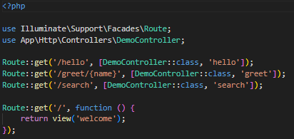
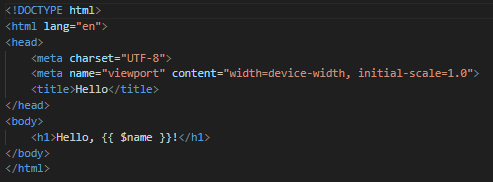
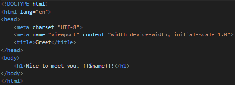
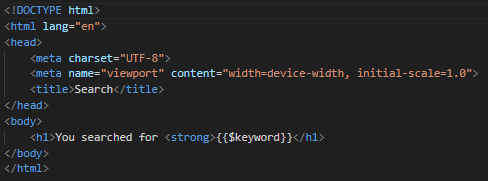
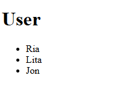

# **LAPORAN PRAKTIKUM MODUL 3**
## **LARAVEL CONTROLLER**

**Nama:** Lediana Berasa  
**NIM:** 2024573010034  
**Kelas:** TI2C  
**Mata Kuliah:** Workshop Web Lanjut  

---

## **ABSTRAK**

Laporan ini membahas penerapan *Controller* pada framework **Laravel**. Controller merupakan bagian penting dari arsitektur **MVC (Model-View-Controller)** yang bertugas menangani logika aplikasi, mengatur aliran data antara Model dan View, serta memproses permintaan dari pengguna melalui *route*.  
Tujuan dari praktikum ini adalah memahami pembuatan dan penggunaan Controller di Laravel seperti **Basic Controller**, **Group Controller**, serta penggunaan **Prefix dan Namespace** untuk mengelompokkan rute. Hasil praktikum menunjukkan bahwa Controller berperan penting dalam menjaga kerapian dan efisiensi pengembangan aplikasi Laravel.

---

## **1. DASAR TEORI**

1. **Controller**
   - Controller digunakan untuk mengatur logika aplikasi.  
   - Berfungsi menerima request, mengelola data melalui Model, dan mengirim response ke View.

2. **MVC (Model-View-Controller)**
   - **Model:** Mengelola data dan interaksi ke database.  
   - **View:** Menampilkan data ke pengguna.  
   - **Controller:** Menjadi perantara antara Model dan View.

3. **Jenis Controller di Laravel**
   - **Basic Controller:** Mengandung beberapa fungsi/aksi dalam satu kelas.  
   - **Resource Controller:** Digunakan untuk operasi CRUD (Create, Read, Update, Delete).  
   - **Invokable Controller:** Hanya memiliki satu fungsi `__invoke()` untuk satu aksi saja.

4. **Route Grouping**
   - Laravel menyediakan `Route::controller()->group()` untuk mengelompokkan rute agar lebih rapi dan mudah dikelola.

5. **Prefix dan Namespace**
   - *Prefix* menambahkan awalan URL (contohnya `/admin`).
   - *Namespace* membantu mengelompokkan controller di dalam folder yang berbeda.

---

## **2. LANGKAH-LANGKAH PRAKTIKUM**

### **2.1 Praktikum 1 – Menangani Request dan Response View di Laravel 12**
  1. Buat sebuah project laravel baru bernama lab-view menggunakan Composer dengan membuka git bash lalu, memberikan perintah
     **composer create-project laravel/laravel:^12.0.3 lab-viewr.** pada saat proses pembuatan project kita akan diminta untuk mengisikan beberapa opsi. 
  2. Kemudian buatlah sebuah Controller dengan perintah **php artisan make:controller DemoController** Setelah berhasil dibuat, 
     file controller dapat ditemukan di folder app/Http/Controllers
     -  
  3. Setelah itu, defenisikan rute 
     - 
 4. Kemudian buatlah view sederhana dan edit file berikut:

   - **hello.blade.php**  
     

   - **greet.blade.php**  
     

   - **search.blade.php**  
     

  7. Buka browser dan ketikkan alamat berikut untuk menguji hasilnya:

   - **http://localhost:8000/hello**  
     

   - **http://127.0.0.1:8000/greet/thariq**  
     

   - **http://127.0.0.1:8000/searc?q=laravel**  
     

  
## **2.2 Praktikum 2 – Menggunakan Group Route**

1. Membuat dan Membuka Proyek Laravel
   Buka terminal lalu buat proyek baru dengan nama **lab-group** menggunakan Composer dengan perintah **composer create-project laravel/laravel:^12.0.3 lab-group**.  
   Setelah proyek berhasil dibuat, buka folder proyek di **Visual Studio Code** untuk mulai mengerjakan.

2. Membuat Controller PageController
   Buat controller baru dengan nama **PageController** menggunakan perintah **php artisan make:controller PageController**
   Controller ini memiliki tiga metode utama yaitu **home()**, **about()**, dan **contact()**, yang masing-masing mengembalikan data ke view.
```php
<?php

namespace App\Http\Controllers;

use Illuminate\Http\Request;

class PageController extends Controller
{
    public function home()
    {
        $message = "Welcome to the homepage.";
        return view('pages.home', compact('message'));
    }

    public function about()
    {
        $message = "This is the about page.";
        return view('pages.about', compact('message'));
    }

    public function contact()
    {
        $message = "Reach us through the contact page.";
        return view('pages.contact', compact('message'));
    }
}
```

3. Mendefinisikan Group Route
   Buka file **routes/web.php** kemudian tambahkan pengelompokan rute menggunakan `Route::controller()->group()`.  
   Semua rute diarahkan ke metode dalam **PageController**, sehingga lebih ringkas dan tidak berulang.
```php
<?php

use Illuminate\Support\Facades\Route;
use App\Http\Controllers\PageController;

Route::controller(PageController::class)->group(function (){
    Route::get('/', 'home',)->name('home');
    Route::get('/about', 'about',)->name('about');
    Route::get('/contact', 'contact',)->name('contact');     

});
```
4. Membuat Folder dan View Sederhana
   Buat folder baru bernama **pages** di dalam direktori **resources/views/**.  
   Di dalam folder tersebut, buat tiga file tampilan:
   
   - home.blade.php
```html
<!DOCTYPE html>
<html lang="en">
<head>
    <meta charset="UTF-8">
    <meta name="viewport" content="width=device-width, initial-scale=1.0">
    <title>About</title>
</head>
<body>
    <h1>{{ $message }}</h1>
</body>
</html
```
- about.blade.php

```html
<!DOCTYPE html>
<html lang="en">
<head>
    <meta charset="UTF-8">
    <meta name="viewport" content="width=device-width, initial-scale=1.0">
    <title>About</title>
</head>
<body>
    <h1>{{ $message }}</h1>
</body>
</html>
```
- contact.blade.php
```html
<!DOCTYPE html>
<html lang="en">
<head>
    <meta charset="UTF-8">
    <meta name="viewport" content="width=device-width, initial-scale=1.0">
    <title>Contact</title>
</head>
<body>
  <h1>{{ $message }}</h1>  
</body>
</html>
```
Setiap file menampilkan konten sesuai dengan halaman masing-masing.

5. Menjalankan Server dan Menguji Hasil
6. Berikut adalah hasil/outputnya:
- Halaman Home  
 - 
- Halaman About
 -   
- Halaman Contact  
 -  

## **2.3 Praktikum 3 – Pengelompokan Prefix dengan Namespace Rute di Laravel 12**

1. Membuat dan Membuka Proyek Laravel
   Buka terminal lalu buat proyek baru dengan nama **lab-prefix** menggunakan Composer dengan perintah **composer create-project laravel/laravel:^12.0.3 lab-prefix**  
   Setelah proyek berhasil dibuat, buka folder proyek di **Visual Studio Code** untuk memulai proses pengembangan.

2. Membuat Controller dengan Namespace
   Buat folder dan dua controller di dalam namespace **Admin** menggunakan perintah artisan:
   php artisan make:controller Admin/DashboardController
   php artisan make:controller Admin/UserController
   lalu, edit seperti ini 

- DashboardController

```php
<?php

namespace App\Http\Controllers\Admin;

use App\Http\Controllers\Controller;

class DashboardController extends Controller
{
    public function index()
    {
        return view('admin.dashboard', ['message'=> 'Welcome to Admin Dashboard']);
    }
}

- UserController

<?php

namespace App\Http\Controllers\Admin;

use App\Http\Controllers\Controller;

class UserController extends Controller
{
    public function index()
    {
        $users = ['Ria', 'Lita', 'Jon'];
        return view('admin.users.index', compact('users'));
    }

    public function show($id)
    {
        $user = "User #" . $id;
        return view('admin.users.show', compact('user'));
    }
}
```
Kedua controller tersebut akan tersimpan di dalam direktori:

3. Mendefinisikan Kelompok Rute dengan Prefix dan Namespace Controller
Buka file **routes/web.php** dan buat kelompok rute menggunakan **prefix** `admin` serta mengarahkan ke controller di namespace `Admin`.  
Dengan cara ini, semua rute yang berkaitan dengan halaman admin akan berada di dalam satu grup yang rapi dan mudah dikelola. Edit Web.php
```php
<?php

use Illuminate\Foundation\Inspiring;
use Illuminate\Support\Facades\Artisan;

Artisan::command('inspire', function () {
    $this->comment(Inspiring::quote());
})->purpose('Display an inspiring quote');
```
4. Menambahkan Aksi pada Controller
Tambahkan aksi sederhana pada controller:
- **DashboardController** → menampilkan halaman dashboard dengan pesan selamat datang.
```php
<?php

namespace App\Http\Controllers\Admin;

use App\Http\Controllers\Controller;

class DashboardController extends Controller
{
    public function index()
    {
        return view('admin.dashboard', ['message'=> 'Welcome to Admin Dashboard']);
    }
}
```
- **UserController** → menampilkan daftar pengguna dan halaman detail pengguna.
```php
<?php

namespace App\Http\Controllers\Admin;

use App\Http\Controllers\Controller;

class UserController extends Controller
{
    public function index()
    {
        $users = ['Ria', 'Lita', 'Jon'];
        return view('admin.users.index', compact('users'));
    }

    public function show($id)
    {
        $user = "User #" . $id;
        return view('admin.users.show', compact('user'));
    }
}
```
Setiap aksi akan mengembalikan data ke view yang sesuai.

5. Membuat View Sederhana
Buat folder baru di dalam **resources/views/** dengan struktur berikut:

Kemudian tambahkan file dan edit:
- dashboard.blade.php
```html
<!DOCTYPE html>
<html lang="en">
<head>
    <meta charset="UTF-8">
    <meta name="viewport" content="width=device-width, initial-scale=1.0">
    <title>Admin Dashboard</title>
</head>
<body>
    <h1>{{ $message }}</h1>
</body>
</html>

- users/index.blade.php

<!DOCTYPE html>
<html lang="en">
<head>
    <meta charset="UTF-8">
    <meta name="viewport" content="width=device-width, initial-scale=1.0">
    <title>Users</title>
</head>
<body>
    <h1>User </h1>
    <ul>
        @foreach ($users as $user)
        <li>{{ $user }}</li>
        @endforeach
    </ul>
</body>
</html>
```
- users/show.blade.php
```html
<!DOCTYPE html>
<html lang="en">
<head>
    <meta charset="UTF-8">
    <meta name="viewport" content="width=device-width, initial-scale=1.0">
    <title>User Details</title>
</head>
<body>
    <h1>Details for: {{ $user }}</h1>
</body>
</html>
```
Setiap file menampilkan isi halaman yang sesuai:
- `dashboard.blade.php` → pesan sambutan admin.  
- `users/index.blade.php` → daftar pengguna.  
- `users/show.blade.php` → detail pengguna.

6. Berikut adalah hasil/outputnya:
- Halaman Dashboard  
 - 
- Daftar Pengguna  
 -  
- Detail Pengguna
 - 

---

## **3. HASIL DAN PEMBAHASAN**

Setelah seluruh langkah praktikum dari **Praktikum 1, 2, dan 3** dilakukan, semua proyek Laravel berjalan dengan baik dan sesuai tujuan pembelajaran.  
Berikut hasil pengujian dari setiap praktikum:

### **Praktikum 1 – Menangani Request dan Response View di Laravel 12**
- Aplikasi berhasil menampilkan data yang diteruskan dari controller ke view.
- URL `http://127.0.0.1:8000/hello` menampilkan pesan **Hello, Laravel Learner!**  
- Rute berparameter seperti `http://127.0.0.1:8000/greet/thariq` berhasil menampilkan pesan sesuai input parameter.  
- Query string juga berjalan dengan benar, menampilkan hasil pencarian dari input yang diberikan pengguna.  
- Hasil ini menunjukkan bahwa controller dan view dapat berkomunikasi dengan baik melalui mekanisme request–response di Laravel.

### **Praktikum 2 – Menggunakan Group Route**
- Proyek **lab-group** berhasil dibuat dan dijalankan dengan lancar.
- Semua rute (`/`, `/about`, `/contact`) berhasil diarahkan ke metode yang sesuai di `PageController`.
- Setiap halaman menampilkan isi view yang berbeda sesuai metode controller-nya.
- Penggunaan **Route::controller()->group()** terbukti efektif untuk menjaga kerapian dan mengurangi pengulangan definisi rute.  
- Hal ini membantu struktur rute lebih terorganisir dan mudah dikembangkan di kemudian hari.

### **Praktikum 3 – Pengelompokan Prefix dengan Namespace Rute di Laravel 12**
- Proyek **lab-prefix** berhasil dijalankan dan menampilkan halaman:
  - `http://127.0.0.1:8000/admin/dashboard` → menampilkan dashboard admin  
  - `http://127.0.0.1:8000/admin/users` → menampilkan daftar pengguna  
  - `http://127.0.0.1:8000/admin/users/2` → menampilkan detail pengguna
- Penggunaan **prefix “admin”** dan **namespace Admin** membantu pemisahan logika antara area publik dan admin.  
- Struktur folder controller yang terorganisir mempermudah pemeliharaan serta meminimalisir kesalahan saat proyek berkembang.  
- Hasil pengujian menunjukkan seluruh rute berjalan sesuai fungsi yang diatur di masing-masing controller.

**Kesimpulan Pembahasan Umum:**
Dari ketiga praktikum ini dapat disimpulkan bahwa controller berperan penting dalam mengatur logika aplikasi, memproses request, dan mengembalikan response.  
Penerapan grouping dan prefix membuat manajemen rute lebih efisien, sedangkan penggunaan namespace meningkatkan keteraturan dalam struktur proyek Laravel.

---

## **4. KESIMPULAN**

1. **Controller** di Laravel berfungsi sebagai penghubung utama antara Model dan View, menangani alur data, serta menentukan respons aplikasi terhadap permintaan pengguna.  
2. **Grouping Route** membantu pengembang mengelompokkan beberapa rute dalam satu controller agar lebih rapi dan mudah dikelola.  
3. **Prefix dan Namespace** digunakan untuk mengatur hierarki controller dan memisahkan area tertentu, seperti area admin atau user, dengan jelas.  
4. Dengan memahami konsep controller, grouping, dan prefix namespace, pengembang dapat membangun aplikasi web Laravel yang lebih **modular, efisien, dan terstruktur**.  
5. Praktikum ini memberikan pemahaman mendasar dalam penerapan MVC (Model-View-Controller) di Laravel 12 dan menjadi dasar penting untuk pengembangan fitur lanjutan.

---

## **5. DAFTAR REFERENSI**

1. **Laravel Documentation – Controllers**  
   [https://laravel.com/docs/12.x/controllers](https://laravel.com/docs/12.x/controllers)

2. **Laravel Documentation – Routing**  
   [https://laravel.com/docs/12.x/routing](https://laravel.com/docs/12.x/routing)

---