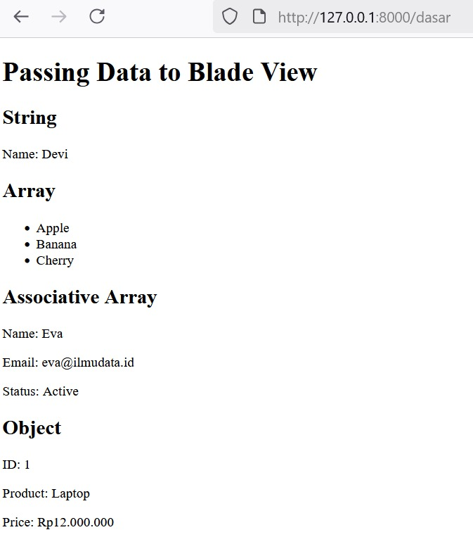
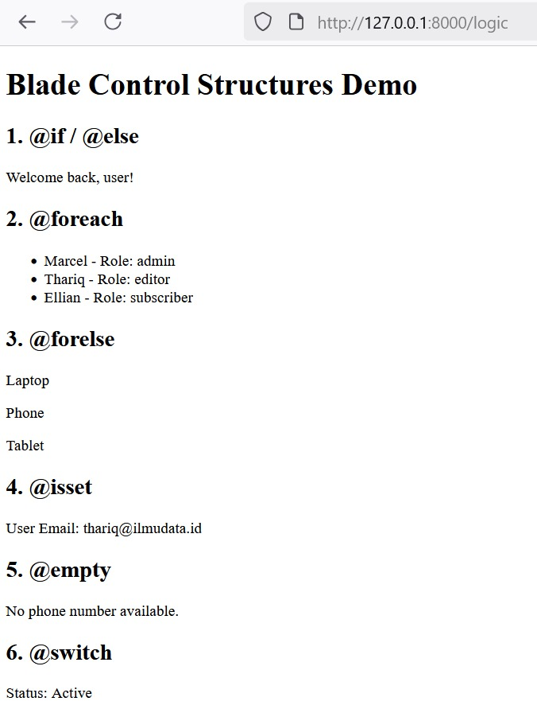
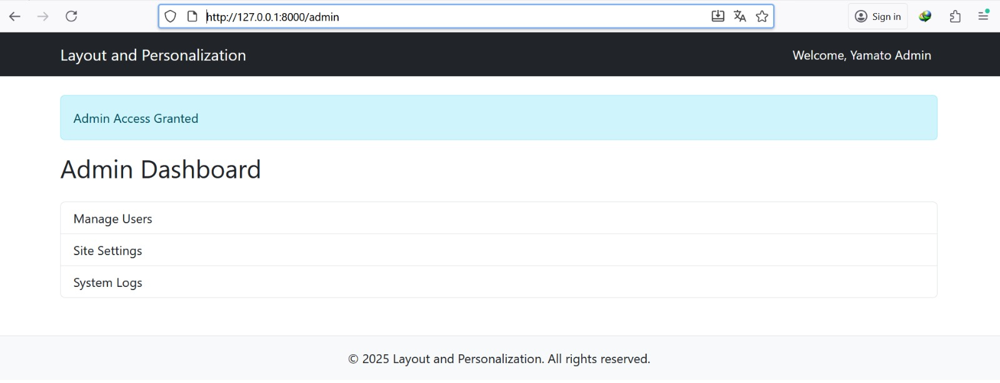
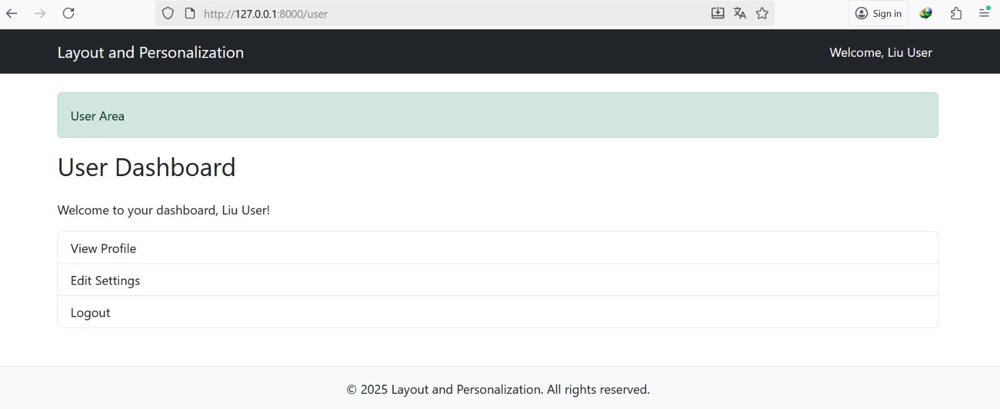
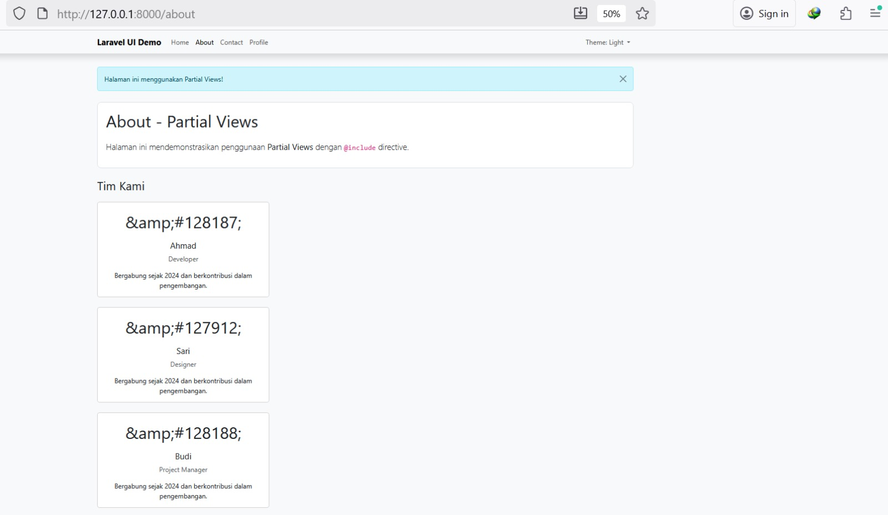
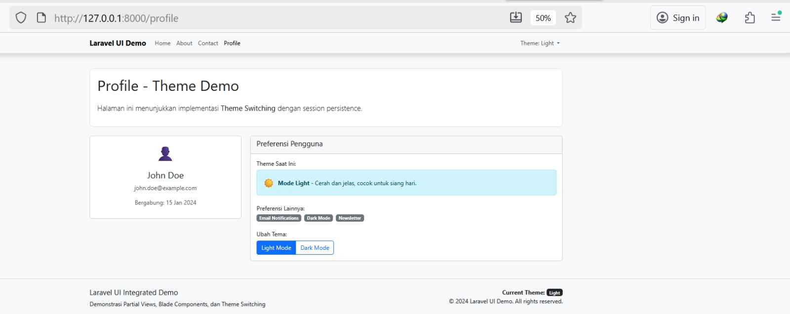
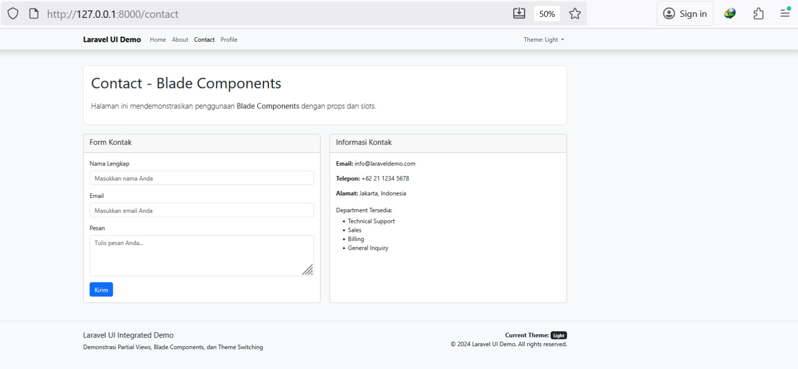
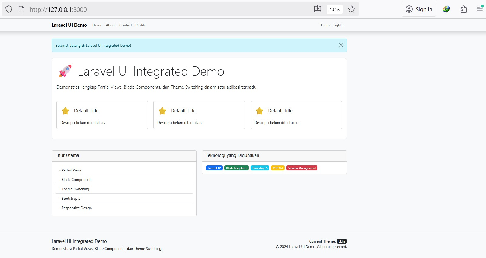

**Laporan Modul 4: Laravel Blade Template Engine**
**Mata Kuliah:** Workshop Web Lanjut   
**Nama:** [Lediana Berasa]  
**NIM:** [2024573010034]  
**Kelas:** [TI2C]  

---

## Abstrak 


## **1. DASAR TEORI**

**Blade** adalah template engine Laravel yang memungkinkan pengembang membuat tampilan dinamis menggunakan sintaks yang lebih ringkas dan mudah dibaca dibandingkan PHP murni.  
Fitur utama Blade:
- Mendukung **template inheritance** (`@extends`, `@section`, `@yield`)
- Memiliki **struktur kontrol** (`@if`, `@foreach`, `@switch`, dll)
- Mendukung **komponen UI reusable** (`<x-component>`)
- Dapat menyertakan **partial view** (`@include`)
- Sangat ringan karena dikompilasi menjadi PHP murni sebelum dirender.

---

## **2. LANGKAH-LANGKAH PRAKTIKUM**
### **2.1 Praktikum 1 – Meneruskan Data dari Controller ke Blade View**
1. Buat sebuah project laravel baru bernama modul-4-blade-view dengan memberikan perintah
   ```bash
    laravel new modul-4-blade-view
   ```
2. Buat controller dengan perintah:
```bash
php artisan make:controller DasarBladeController
```
3. Edit file routes/web.php:
```php
<?php

use Illuminate\Support\Facades\Route;
use App\Http\Controllers\DasarBladeController;

Route::get('/dasar', [DasarBladeController::class, 'showData']);

Route::get('/', function () {
    return view('welcome');
});

```
4. Tambahkan method di app/Http/Controllers/DasarBladeController.php:
```php
<?php

namespace App\Http\Controllers;

use Illuminate\Http\Request;

class DasarBladeController extends Controller
{
public function showData()
{
    $name = 'Devi';
    $fruits = ['Apple', 'Banana', 'Cherry'];
    $user = [
        'name' => 'Eva',
        'email' => 'eva@ilmudata.id',
        'is_active' => true,
    ];
    $product = (object) [
        'id' => 1,
        'name' => 'Laptop',
        'price' => 12000000
    ];
    
    return view('dasar', compact('name', 'fruits', 'user', 'product'));
}

}
```
5. Buat file view resources/views/dasar.blade.php
```html
<!DOCTYPE html>
<html>
<head>
    <title>Data Passing Demo</title>
</head>
<body>
    <h1>Passing Data to Blade View</h1>
    
    <h2>String</h2>
    <p>Name: {{ $name }}</p>
    
    <h2>Array</h2>
    <ul>
        @foreach ($fruits as $fruit)
            <li>{{ $fruit }}</li>
        @endforeach
    </ul>
    
    <h2>Associative Array</h2>
    <p>Name: {{ $user['name'] }}</p>
    <p>Email: {{ $user['email'] }}</p>
    <p>Status: {{ $user['is_active'] ? 'Active' : 'Inactive' }}</p>
    
    <h2>Object</h2>
    <p>ID: {{ $product->id }}</p>
    <p>Product: {{ $product->name }}</p>
    <p>Price: Rp{{ number_format($product->price, 0, ',', '.') }}</p>
</body>
</html>
```
6. Buka browser dan kunjungi: http://127.0.0.1:8000/dasar
    - Berikut adalah Output nya:
    - Halaman Dasar
-     
### **2.1 Praktikum 2 – Menggunakan Struktur Kontrol Blade**
1. Masih dengan project yang sama yaitu modul-4-blade-view Berikutnya, buatlah sebuah controller baru dengan perintah
```bash
php artisan make:controller LogicController
```
2. Tambahkan route baru dengan cara buka routes/web.php dan tambahkan:

```php
use App\Http\Controllers\LogicController;

Route::get('/logic', [LogicController::class, 'show']);
```
3. Tambahkan method di LogicController:
```php
public function show()
{
    $isLoggedIn = true;
    $users = [
        ['name' => 'Marcel', 'role' => 'admin'],
        ['name' => 'Thariq', 'role' => 'editor'],
        ['name' => 'Ellian', 'role' => 'subscriber'],
    ];
    $products = []; // Simulasi array kosong untuk @forelse
    $profile = [
        'name' => 'Thariq',
        'email' => 'thariq@ilmudata.id'
    ];
    $status = 'active';
    
    return view('logic', compact('isLoggedIn', 'users', 'products', 'profile', 'status'));
}

```
4. Buat file view resources/views/logic.blade.php sesuai instruksi.
```html
<!DOCTYPE html>
<html>
<head>
    <title>Blade Logic Demo</title>
</head>
<body>
    <h1>Blade Control Structures Demo</h1>
    
    <h2>1. @@if / @@else</h2>
    @if ($isLoggedIn)
        <p>Welcome back, user!</p>
    @else
        <p>Please log in.</p>
    @endif
    
    <h2>2. @@foreach</h2>
    <ul>
        @foreach ($users as $user)
            <li>{{ $user['name'] }} - Role: {{ $user['role'] }}</li>
        @endforeach
    </ul>
    
    <h2>3. @@forelse</h2>
    @forelse ($products as $product)
        <p>{{ $product }}</p>
    @empty
        <p>No products found.</p>
    @endforelse
    
    <h2>4. @@isset</h2>
    @isset($profile['email'])
        <p>User Email: {{ $profile['email'] }}</p>
    @endisset
    
    <h2>5. @@empty</h2>
    @empty($profile['phone'])
        <p>No phone number available.</p>
    @endempty
    
    <h2>6. @@switch</h2>
    @switch($status)
        @case('active')
            <p>Status: Active</p>
            @break
        @case('inactive')
            <p>Status: Inactive</p>
            @break
        @default
            <p>Status: Unknown</p>
    @endswitch
</body>
</html>
```
5. Buka browser dan kunjungi: 
    - Berikut adalah Output nya:
     - Halaman Logic
- 

### **2.1 Praktikum 3 – Layout dan Personalisasi di Laravel 12 dengan Bootstrap**
1.  Masih dengan project yang sama yaitu modul-4-blade-view Berikutnya, buatlah sebuah controller baru dengan perintah
```bash
php artisan make:controller PageController
```
    - Berikut adalah Output nya:
2. Tambahkan route baru dengan cara buka routes/web.php dan tambahkan:

```php
use App\Http\Controllers\PageController;

Route::get('/admin', [PageController::class, 'admin']);
Route::get('/user', [PageController::class, 'user']);
```
3. Tambahkan method di LogicController:
```php
<?php

namespace App\Http\Controllers;

use Illuminate\Http\Request;

class LogicController extends Controller
{
    public function show()
{
    $isLoggedIn = true;
    $users = [
        ['name' => 'Marcel', 'role' => 'admin'],
        ['name' => 'Thariq', 'role' => 'editor'],
        ['name' => 'Ellian', 'role' => 'subscriber'],
    ];
    $products = []; // Simulasi array kosong untuk @forelse
    $profile = [
        'name' => 'Thariq',
        'email' => 'thariq@ilmudata.id'
    ];
    $status = 'active';
    
    return view('logic', compact('isLoggedIn', 'users', 'products', 'profile', 'status'));
}
}
```
4. Buat file view resources/views/logic.blade.php sesuai instruksi.
```php
<!DOCTYPE html>
<html>
<head>
    <title>Blade Logic Demo</title>
</head>
<body>
    <h1>Blade Control Structures Demo</h1>
    
    <h2>1. @@if / @@else</h2>
    @if ($isLoggedIn)
        <p>Welcome back, user!</p>
    @else
        <p>Please log in.</p>
    @endif
    
    <h2>2. @@foreach</h2>
    <ul>
        @foreach ($users as $user)
            <li>{{ $user['name'] }} - Role: {{ $user['role'] }}</li>
        @endforeach
    </ul>
    
    <h2>3. @@forelse</h2>
    @forelse ($products as $product)
        <p>{{ $product }}</p>
    @empty
        <p>No products found.</p>
    @endforelse
    
    <h2>4. @@isset</h2>
    @isset($profile['email'])
        <p>User Email: {{ $profile['email'] }}</p>
    @endisset
    
    <h2>5. @@empty</h2>
    @empty($profile['phone'])
        <p>No phone number available.</p>
    @endempty
    
    <h2>6. @@switch</h2>
    @switch($status)
        @case('active')
            <p>Status: Active</p>
            @break
        @case('inactive')
            <p>Status: Inactive</p>
            @break
        @default
            <p>Status: Unknown</p>
    @endswitch
</body>
</html>
```
5. Buka browser dan kunjungi: 
    - Berikut adalah Output nya:
    - Halaman Admin
- 
    - Halaman User
- 
### **2.1 Praktikum 4 – Partial Views, Blade Components, dan Theme Switching di Laravel 12**
1. Buat sebuah project laravel baru bernama modul-4-blade-view dengan memberikan perintah
   ```bash
   laravel new modul-4-laravel-ui
   ```
2. Buat controller dengan perintah:
```bash
php artisan make:controller UIController
```
- Edit app/Http/Controllers/UIController.php:
```php
<?php

namespace App\Http\Controllers;

use Illuminate\Http\Request;

class UIController extends Controller
{
    public function home(Request $request)
    {
        $theme = session('theme', 'light');
        $alertMessage = 'Selamat datang di Laravel UI Integrated Demo!';
        $features = [
            'Partial Views',
            'Blade Components', 
            'Theme Switching',
            'Bootstrap 5',
            'Responsive Design'
        ];
        
        return view('home', compact('theme', 'alertMessage', 'features'));
    }

    public function about(Request $request)
    {
        $theme = session('theme', 'light');
        $alertMessage = 'Halaman ini menggunakan Partial Views!';
        $team = [
            ['name' => 'Ahmad', 'role' => 'Developer'],
            ['name' => 'Sari', 'role' => 'Designer'],
            ['name' => 'Budi', 'role' => 'Project Manager']
        ];
        
        return view('about', compact('theme', 'alertMessage', 'team'));
    }

    public function contact(Request $request)
    {
        $theme = session('theme', 'light');
        $departments = [
            'Technical Support',
            'Sales',
            'Billing',
            'General Inquiry'
        ];
        
        return view('contact', compact('theme', 'departments'));
    }

    public function profile(Request $request)
    {
        $theme = session('theme', 'light');
        $user = [
            'name' => 'John Doe',
            'email' => 'john.doe@example.com',
            'join_date' => '2024-01-15',
            'preferences' => ['Email Notifications', 'Dark Mode', 'Newsletter']
        ];
        
        return view('profile', compact('theme', 'user'));
    }

    public function switchTheme($theme, Request $request)
    {
        if (in_array($theme, ['light', 'dark'])) {
            session(['theme' => $theme]);
        }
        return back();
    }
}
```
3. Edit file routes/web.php:
```php
<?php

use Illuminate\Support\Facades\Route;
use App\Http\Controllers\UIController;

Route::get('/', function () {
    return view('welcome');
});
Route::get('/', [UIController::class, 'home'])->name('home');
Route::get('/about', [UIController::class, 'about'])->name('about');
Route::get('/contact', [UIController::class, 'contact'])->name('contact');
Route::get('/profile', [UIController::class, 'profile'])->name('profile');
Route::get('/switch-theme/{theme}', [UIController::class, 'switchTheme'])->name('switch-theme');
```
4. Buat Layout Utama dengan Theme Support. Buat direktori layouts di resources/views jika belum ada. Kemudian buat
Buat Partial Views lalu edit.
- app.blade.php
```php
<!DOCTYPE html>
<html lang="id" data-bs-theme="{{ $theme }}">
<head>
    <meta charset="UTF-8">
    <meta name="viewport" content="width=device-width, initial-scale=1.0">
    <title>@yield('title', 'Laravel UI Integrated Demo')</title>
    <link href="https://cdn.jsdelivr.net/npm/bootstrap@5.3.3/dist/css/bootstrap.min.css" rel="stylesheet">
    <style>
        body {
            padding-top: 4rem;
            transition: all 0.3s ease;
            min-height: 100vh;
        }
        .theme-demo {
            border-radius: 10px;
            padding: 20px;
            margin: 10px 0;
            transition: all 0.3s ease;
        }
        .feature-card {
            transition: transform 0.2s ease;
        }
        .feature-card:hover {
            transform: translateY(-5px);
        }
    </style>
</head>
<body class="{{ $theme === 'dark' ? 'bg-dark text-light' : 'bg-light text-dark' }}">
    
    <!-- Navigation menggunakan Partial View -->
    @include('partials.navigation')
    
    <div class="container mt-4">
        
        <!-- Alert menggunakan Partial View -->
        @if(isset($alertMessage) && !empty($alertMessage))
            @include('partials.alert', ['message' => $alertMessage, 'type' => 'info'])
        @endif
        
        @yield('content')
    </div>
    
    <!-- Footer menggunakan Blade Component -->
    <x-footer :theme="$theme" />
    
    <script src="https://cdn.jsdelivr.net/npm/bootstrap@5.3.3/dist/js/bootstrap.bundle.min.js"></script>
    <script>
        // Smooth theme transition
        document.addEventListener('DOMContentLoaded', function() {
            const themeLinks = document.querySelectorAll('a[href*="switch-theme"]');
            themeLinks.forEach(link => {
                link.addEventListener('click', function(e) {
                    e.preventDefault();
                    window.location.href = this.href;
                });
            });
        });
    </script>
</body>
</html>
```
5. Buat direktori partials di resources/views dan buat file berikut:
- alert.blade.php
```html
@if(!empty($message))
<div class="alert alert-{{ $type ?? 'info' }} alert-dismissible fade show" role="alert">
    {{ $message }}
    <button type="button" class="btn-close" data-bs-dismiss="alert"></button>
</div>
@endif
```
- navigation.blade.php
```html
<nav class="navbar navbar-expand-lg {{ $theme === 'dark' ? 'navbar-dark bg-dark' : 'navbar-light bg-light' }} fixed-top shadow">
    <div class="container">
        <a class="navbar-brand fw-bold" href="{{ route('home') }}">
            Laravel UI Demo
        </a>
        
        <button class="navbar-toggler" type="button" data-bs-toggle="collapse" data-bs-target="#navbarNav">
            <span class="navbar-toggler-icon"></span>
        </button>
        
        <div class="collapse navbar-collapse" id="navbarNav">
            <ul class="navbar-nav me-auto">
                <li class="nav-item">
                    <a class="nav-link {{ request()->routeIs('home') ? 'active' : '' }}" href="{{ route('home') }}">Home</a>
                </li>
                <li class="nav-item">
                    <a class="nav-link {{ request()->routeIs('about') ? 'active' : '' }}" href="{{ route('about') }}">About</a>
                </li>
                <li class="nav-item">
                    <a class="nav-link {{ request()->routeIs('contact') ? 'active' : '' }}" href="{{ route('contact') }}">Contact</a>
                </li>
                <li class="nav-item">
                    <a class="nav-link {{ request()->routeIs('profile') ? 'active' : '' }}" href="{{ route('profile') }}">Profile</a>
                </li>
            </ul>
            
            <ul class="navbar-nav">
                <li class="nav-item dropdown">
                    <a class="nav-link dropdown-toggle" href="#" role="button" data-bs-toggle="dropdown">
                        Theme: {{ ucfirst($theme) }}
                    </a>
                    <ul class="dropdown-menu">
                        <li><a class="dropdown-item" href="{{ route('switch-theme', 'light') }}">Light Mode</a></li>
                        <li><a class="dropdown-item" href="{{ route('switch-theme', 'dark') }}">Dark Mode</a></li>
                    </ul>
                </li>
            </ul>
        </div>
    </div>
</nav>
```
- team-stats.blade.php
```html
<div class="card {{ $theme === 'dark' ? 'bg-dark border-light' : '' }} mt-4">
    <div class="card-header">
        <h5>Statistik Tim</h5>
    </div>
    <div class="card-body">
        <div class="row text-center">
            <div class="col-md-3">
                <h3>3</h3>
                <p class="text-muted">Anggota</p>
            </div>
            <div class="col-md-3">
                <h3>12+</h3>
                <p class="text-muted">Proyek</p>
            </div>
            <div class="col-md-3">
                <h3>95%</h3>
                <p class="text-muted">Kepuasan</p>
            </div>
            <div class="col-md-3">
                <h3>2+</h3>
                <p class="text-muted">Tahun</p>
            </div>
        </div>
    </div>
</div>
```
6. Buat Blade Components
```bash
php artisan make:component Footer
php artisan make:component FeatureCard
php artisan make:component TeamMember
php artisan make:component ContactForm
```
Lalu Edit file tersebut
7. Buat view-view utama:
- resources/views/home.blade.php:

```html
@extends('layouts.app')

@section('title', 'Home - Integrated Demo')

@section('content')
<div class="row">
    <div class="col-12">
        <div class="theme-demo {{ $theme === 'dark' ? 'bg-dark border-light' : 'bg-white border' }} mb-5">
            <h1 class="display-4 mb-4">🚀 Laravel UI Integrated Demo</h1>
            <p class="lead">Demonstrasi lengkap Partial Views, Blade Components, dan Theme Switching dalam satu aplikasi terpadu.</p>
            
            <div class="row mt-5">
                <div class="col-md-4 mb-4">
                    <x-feature-card 
                        title="Partial Views"
                        icon="📁"
                        description="Gunakan @include untuk reusable UI components dengan data sederhana."
                        badge="Latihan 13"
                    />
                </div>
                <div class="col-md-4 mb-4">
                    <x-feature-card 
                        title="Blade Components" 
                        icon="🧩"
                        description="Komponen Blade dengan props dan slots untuk UI yang lebih kompleks."
                        badge="Latihan 14"
                    />
                </div>
                <div class="col-md-4 mb-4">
                    <x-feature-card 
                        title="Theme Switching"
                        icon="🎨"
                        description="Toggle antara light dan dark mode dengan session persistence."
                        badge="Latihan 15"
                    />
                </div>
            </div>
        </div>

        <div class="row">
            <div class="col-md-6">
                <div class="card {{ $theme === 'dark' ? 'bg-dark border-light' : '' }} mb-4">
                    <div class="card-header">
                        <h5>Fitur Utama</h5>
                    </div>
                    <div class="card-body">
                        <ul class="list-group list-group-flush">
                            @foreach($features as $feature)
                            <li class="list-group-item {{ $theme === 'dark' ? 'bg-dark text-light' : '' }}">
                                - {{ $feature }}
                            </li>
                            @endforeach
                        </ul>
                    </div>
                </div>
            </div>
            <div class="col-md-6">
                <div class="card {{ $theme === 'dark' ? 'bg-dark border-light' : '' }}">
                    <div class="card-header">
                        <h5>Teknologi yang Digunakan</h5>
                    </div>
                    <div class="card-body">
                        <div class="d-flex flex-wrap gap-2">
                            <span class="badge bg-primary">Laravel 12</span>
                            <span class="badge bg-success">Blade Templates</span>
                            <span class="badge bg-info">Bootstrap 5</span>
                            <span class="badge bg-warning">PHP 8.4</span>
                            <span class="badge bg-danger">Session Management</span>
                        </div>
                    </div>
                </div>
            </div>
        </div>
    </div>
</div>
@endsection
```
- resources/views/about.blade.php:
```html
@extends('layouts.app')

@section('title', 'About - Partial Views Demo')

@section('content')
<div class="row">
    <div class="col-12">
        <div class="theme-demo {{ $theme === 'dark' ? 'bg-dark border-light' : 'bg-white border' }} mb-4">
            <h1 class="mb-4">About - Partial Views</h1>
            <p class="mb-4">Halaman ini mendemonstrasikan penggunaan partial views di Laravel Blade dengan tema {{ $theme }}.</p>
        </div>

        <h3 class="mb-4">Tim Kami</h3>
        <div class="row">
            @foreach($team as $member)
            <x-team-member 
                :name="$member['name']"
                :role="$member['role']"
                :theme="$theme"
                :avatar="['👨💻','👩🎨','👨💼'][$loop->index]"
                :description="'Bergabung sejak 2024 dan berkontribusi dalam pengembangan.'"
            />
            @endforeach
        </div>

        <!-- Demonstrasi Partial View dengan Data -->
        @include('partials.team-stats', ['theme' => $theme])
    </div>
</div>
@endsection
```
- resources/views/partials/team-stats.blade.php:
```html
@props(['name', 'role', 'theme' => 'light', 'avatar' => '👤', 'description' => ''])
<div class="col-md-4 mb-4">
    <div class="card {{ $theme === 'dark' ? 'bg-dark border-light' : '' }} h-100">
        <div class="card-body text-center">
            <div class="mb-3">
                <span class="fs-1">{{ $avatar ?? '👤' }}</span>
            </div>
            <h5 class="card-title">{{ $name }}</h5>
            <p class="card-text text-muted">{{ $role }}</p>
            <p class="card-text">{{ $description }}</p>
        </div>
    </div>
</div>
```
- resources/views/contact.blade.php:
```html
@extends('layouts.app')

@section('title', 'Contact - Components Demo')

@section('content')
<div class="row">
    <div class="col-12">
        <div class="theme-demo {{ $theme === 'dark' ? 'bg-dark border-light' : 'bg-white border' }} mb-4">
            <h1 class="mb-4">Contact - Blade Components</h1>
            <p class="lead">Halaman ini mendemonstrasikan penggunaan <strong>Blade Components</strong> dengan props dan slots.</p>
        </div>

        <div class="row">
            <div class="col-md-6">
                <x-contact-form :theme="$theme" :departments="$departments" />
            </div>
            <div class="col-md-6">
                <div class="card {{ $theme === 'dark' ? 'bg-dark border-light' : '' }} h-100">
                    <div class="card-header">
                        <h5>Informasi Kontak</h5>
                    </div>
                    <div class="card-body">
                        <p><strong>Email:</strong> info@laraveldemo.com</p>
                        <p><strong>Telepon:</strong> +62 21 1234 5678</p>
                        <p><strong>Alamat:</strong> Jakarta, Indonesia</p>
                        
                        <h6 class="mt-4">Department Tersedia:</h6>
                        <ul>
                            @foreach($departments as $dept)
                            <li>{{ $dept }}</li>
                            @endforeach
                        </ul>
                    </div>
                </div>
            </div>
        </div>
    </div>
</div>
@endsection
```

- resources/views/components/contact-form.blade.php:
```html
@props(['departments' => [], 'theme' => 'light'])
<div class="card {{ $theme === 'dark' ? 'bg-dark border-light' : '' }} h-100">
    <div class="card-header">
        <h5>Form Kontak</h5>
    </div>
    <div class="card-body">
        <form>
            <div class="mb-3">
                <label class="form-label">Nama Lengkap</label>
                <input type="text" class="form-control {{ $theme === 'dark' ? 'bg-dark text-light border-light' : '' }}" placeholder="Masukkan nama Anda">
            </div>
            
            <div class="mb-3">
                <label class="form-label">Email</label>
                <input type="email" class="form-control {{ $theme === 'dark' ? 'bg-dark text-light border-light' : '' }}" placeholder="nama@example.com">
            </div>
            
            <div class="mb-3">
                <label class="form-label">Department</label>
                <select class="form-select {{ $theme === 'dark' ? 'bg-dark text-light border-light' : '' }}">
                    <option selected>Pilih department...</option>
                    @foreach($departments as $dept)
                    <option value="{{ $dept }}">{{ $dept }}</option>
                    @endforeach
                </select>
            </div>
            
            <div class="mb-3">
                <label class="form-label">Pesan</label>
                <textarea class="form-control {{ $theme === 'dark' ? 'bg-dark text-light border-light' : '' }}" rows="4" placeholder="Tulis pesan Anda..."></textarea>
            </div>
            
            <button type="submit" class="btn btn-primary">Kirim Pesan</button>
        </form>
    </div>
</div>
```

- resources/views/profile.blade.php:

```html
@extends('layouts.app')

@section('title', 'Profile - Theme Demo')

@section('content')
<div class="row">
    <div class="col-12">
        <div class="theme-demo {{ $theme === 'dark' ? 'bg-dark border-light' : 'bg-white border' }} mb-4">
            <h1 class="mb-4">Profile - Theme Demo</h1>
            <p class="lead">Halaman ini menunjukkan implementasi <strong>Theme Switching</strong> dengan session persistence.</p>
        </div>

        <div class="row">
            <div class="col-md-4">
                <div class="card {{ $theme === 'dark' ? 'bg-dark border-light' : '' }} text-center">
                    <div class="card-body">
                        <div class="mb-3">
                            <span class="fs-1">👤</span>
                        </div>
                        <h4>{{ $user['name'] }}</h4>
                        <p class="text-muted">{{ $user['email'] }}</p>
                        <p class="text-muted">Bergabung: {{ date('d M Y', strtotime($user['join_date'])) }}</p>
                    </div>
                </div>
            </div>
            
            <div class="col-md-8">
                <div class="card {{ $theme === 'dark' ? 'bg-dark border-light' : '' }}">
                    <div class="card-header">
                        <h5>Preferensi Pengguna</h5>
                    </div>
                    <div class="card-body">
                        <h6>Theme Saat Ini:</h6>
                        <div class="alert alert-{{ $theme === 'dark' ? 'dark' : 'info' }} d-flex align-items-center">
                            <span class="me-2 fs-4">{{ $theme === 'dark' ? '🌙' : '☀️' }}</span>
                            <div>
                                <strong>Mode {{ ucfirst($theme) }}</strong> - 
                                @if($theme === 'dark')
                                    Nyaman di malam hari dan mengurangi ketegangan mata.
                                @else
                                    Cerah dan jelas, cocok untuk siang hari.
                                @endif
                            </div>
                        </div>
                        
                        <h6 class="mt-4">Preferensi Lainnya:</h6>
                        <div class="d-flex flex-wrap gap-2">
                            @foreach($user['preferences'] as $pref)
                            <span class="badge bg-secondary">{{ $pref }}</span>
                            @endforeach
                        </div>
                        
                        <div class="mt-4">
                            <h6>Ubah Tema:</h6>
                            <div class="btn-group" role="group">
                                <a href="{{ route('switch-theme', 'light') }}" 
                                   class="btn btn-{{ $theme === 'light' ? 'primary' : 'outline-primary' }}">
                                    Light Mode
                                </a>
                                <a href="{{ route('switch-theme', 'dark') }}" 
                                   class="btn btn-{{ $theme === 'dark' ? 'primary' : 'outline-primary' }}">
                                    Dark Mode
                                </a>
                            </div>
                        </div>
                    </div>
                </div>
            </div>
        </div>
    </div>
</div>
@endsection
```

8. Buka browser dan kunjungi: 
    - Berikut adalah Output nya:
    - Halaman About  
     - 
    - Halaman About
     -   
    - Halaman Contact  
     -  
    - Halaman Home
     -  


## **3. HASIL DAN PEMBAHASAN**

Setelah melakukan seluruh langkah praktikum Laravel Blade, mulai dari meneruskan data ke view, penggunaan struktur kontrol, hingga layout dan komponen Blade, didapatkan hasil sebagai berikut:

### **Praktikum 1 – Passing Data ke Blade View**
Aplikasi berhasil menampilkan data dari controller ke view menggunakan sintaks `{{ $variable }}`.  
Data berupa string, array, dan objek berhasil diteruskan dan ditampilkan dengan benar.

```php
// Contoh pada HomeController
public function index() {
    $message = "Selamat datang di halaman utama!";
    return view('home', compact('message'));
}
```
Praktikum 2 – Struktur Kontrol Blade
Direktif Blade seperti @if, @else, @foreach, dan @forelse berhasil dijalankan dengan baik.
Blade membantu menulis logika tampilan secara lebih rapi tanpa perlu banyak tag PHP.

```php
// Contoh penggunaan kontrol pada view
<ul>
@foreach($items as $item)
   <li>{{ $item }}</li>
@endforeach
</ul>
```
Praktikum 3 – Layout dan Template
Konsep layout utama menggunakan @extends, @section, dan @yield telah berhasil diterapkan.
File layout app.blade.php menjadi template utama, sedangkan file lainnya seperti home.blade.php dan about.blade.php menjadi child view.

```html

// Contoh layout app.blade.php
<!DOCTYPE html>
<html lang="en">
<head>
   <title>@yield('title')</title>
</head>
<body>
   <header>@include('partials.header')</header>
   <main>@yield('content')</main>
   <footer>@include('partials.footer')</footer>
</body>
</html>
```
Praktikum 4 – Komponen, Partial, dan Tema
Penggunaan komponen Blade (<x-component>), partial view (@include), serta sistem tema gelap dan terang berhasil diterapkan.
Perubahan tema dilakukan menggunakan session yang disimpan saat tombol tema diklik.

```php
// Contoh component alert.blade.php
<div class="alert alert-{{ $type }}">
   {{ $message }}
</div>
```
Hasilnya:
Komponen dapat dipanggil di berbagai halaman menggunakan tag <x-alert> tanpa perlu menulis ulang kodenya.
Partial seperti @include('partials.header') membantu memisahkan bagian tampilan agar lebih teratur.
Tema light mode dan dark mode dapat diterapkan dengan menyimpan preferensi pengguna di session, lalu menyesuaikan tampilan sesuai pilihan tersebut.
Secara keseluruhan, penerapan Blade membuat tampilan web menjadi lebih modular, mudah diatur, dan efisien dalam pengelolaan kode.

## **4. KESIMPULAN**
Laravel Blade Template Engine merupakan salah satu komponen utama dalam arsitektur Laravel yang berperan penting dalam mengatur tampilan antarmuka aplikasi web. Dengan Blade, pengembang dapat menulis kode HTML yang terintegrasi dengan sintaks PHP secara efisien dan tetap mudah dibaca.
Penggunaan layout, section, dan include pada Blade memungkinkan pengembang untuk membangun struktur tampilan yang konsisten di seluruh halaman aplikasi tanpa harus menulis ulang kode berulang kali. Hal ini mendukung prinsip DRY (Don't Repeat Yourself) yang sangat penting dalam pengembangan perangkat lunak modern.
Selain itu, struktur kontrol seperti @if, @foreach, dan @switch membuat logika tampilan lebih ringkas dan terorganisir dibandingkan dengan penggunaan PHP murni. Blade juga mendukung komponen dan slot, yang menjadikannya ideal untuk membuat antarmuka dinamis dan modular — di mana setiap bagian tampilan dapat dikelola secara independen namun tetap terhubung dalam satu sistem layout utama.
Penerapan tema dinamis dan kemampuan inheritance template (pewarisan tampilan) juga memperlihatkan fleksibilitas Blade dalam mendukung berbagai variasi antarmuka pengguna tanpa mengubah struktur dasar aplikasi. Dengan demikian, Blade memberikan keseimbangan antara kemudahan pengembangan, keteraturan struktur kode, serta kemampuan ekspansi proyek di masa depan.
Secara keseluruhan, dapat disimpulkan bahwa Blade Template Engine meningkatkan efisiensi kerja pengembang, menjaga konsistensi desain, serta memperkuat prinsip modularitas dan keterbacaan kode dalam pengembangan aplikasi web berbasis Laravel.
## **5. DAFTAR REFERENSI**

    1. Laravel Documentation – Blade Templates
        https://laravel.com/docs/12.x/blade
    2. Kinsta – Understanding Laravel Blade and How To Use It
        https://kinsta.com/blog/laravel-blade/
    3. InMotion Hosting – Laravel Blade Basics
        https://www.inmotionhosting.com/support/edu/laravel/laravel-blade-basics/
    4. Tutorialspoint – Laravel Blade Templates
        https://www.tutorialspoint.com/laravel/laravel_blade_templates.htm