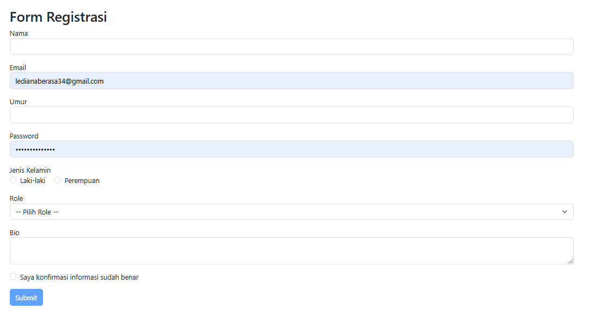
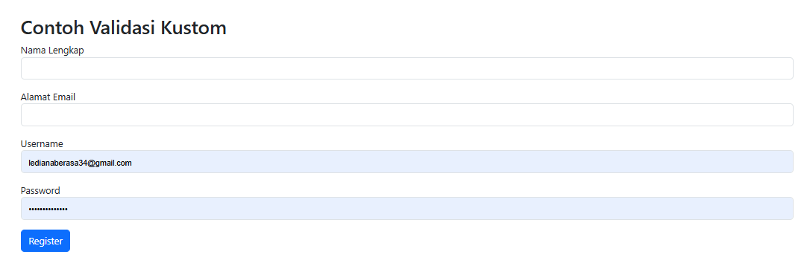
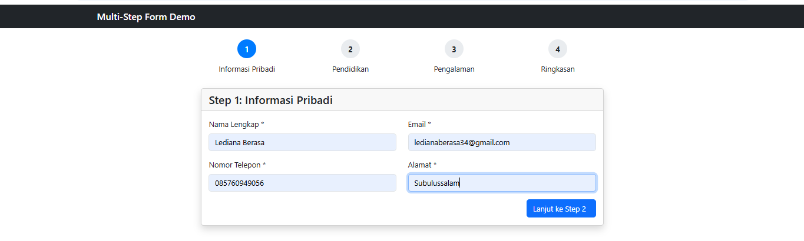
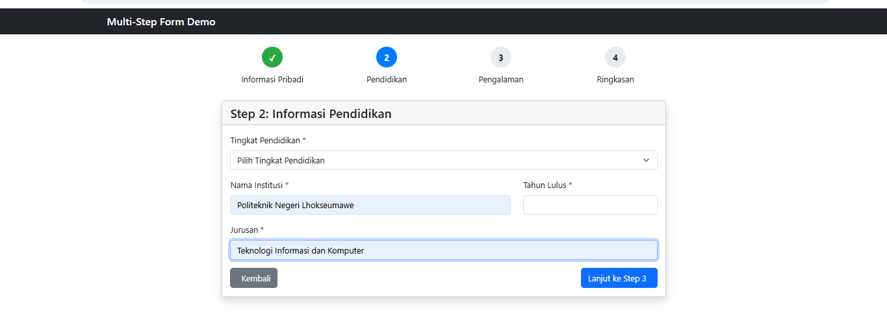
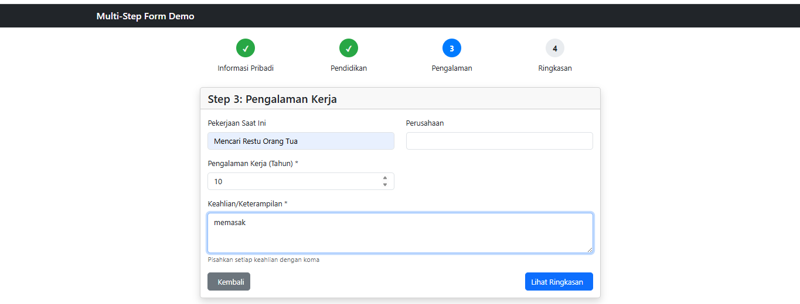
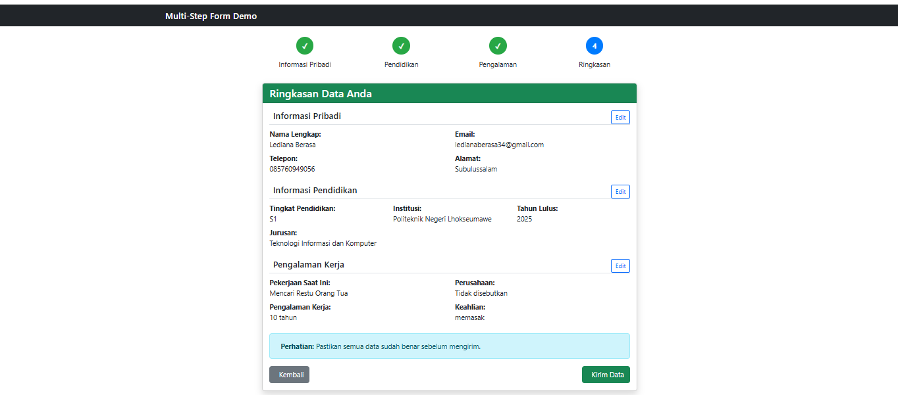

# **Laporan Modul 5: Form Submission & Data Validation**

**Mata Kuliah:** Workshop Web Lanjut
**Nama:** Lediana Berasa
**NIM:** [2024573010034]
**Kelas:** [TI2C]

---

## **Abstrak**

Di laporan ini, saya akan membahas tentang cara kerja **Form Submission & Data Validation** di Laravel 12. Tujuannya adalah untuk memahami bagaimana Laravel mengatur pengiriman data dari form yang kita buat ke server, serta bagaimana cara memvalidasi data tersebut agar aplikasi web kita lebih aman dan terpercaya. Dari praktikum yang saya lakukan, kita akan belajar tentang **CSRF Protection**, **Multi-Step Form Submission**, dan **Custom Validation Messages** yang bisa bikin aplikasi kita lebih aman dan nyaman dipakai. Hasilnya? Laravel ternyata punya sistem yang mantap banget untuk mengelola input dari pengguna, nge-validasi data, dan kasih feedback yang jelas. Semua ini dirancang dengan mempertimbangkan keamanan, kemudahan penggunaan, dan fleksibilitas.

---

## **1. Dasar Teori**

* **Form Submission di Laravel**
  Di Laravel, form submission itu ngikutin pola MVC. View-nya yang nampilin form HTML ke user, Controller-nya yang nerima dan proses data yang dikirim, Model-nya yang ngobrol sama database buat nyimpen atau ambil data, Request-nya yang bawa data dari client ke server, dan Response-nya yang balikin hasilnya ke client.

* **HTTP Methods di Form**
  Laravel support berbagai HTTP methods: POST buat kirim data baru (create), PUT/PATCH buat update data yang udah ada, DELETE buat hapus data, dan GET buat ambil data (tapi bukan buat form submission). Soalnya HTML form cuma support GET dan POST, Laravel pake trik method spoofing dengan @method('PUT') buat nyimulasi HTTP methods lainnya.

* **CSRF Protection**
  CSRF (Cross-Site Request Forgery) itu serangan di mana penyerang ngejebak user buat melakukan aksi yang nggak diinginkan di aplikasi tempat mereka udah login. Laravel pake sistem token-based protection, di mana setiap session dapet CSRF token unik yang disimpan di session user. Middleware VerifyCsrfToken bakal bandingin token dari form dengan token di session.

* **Data Validation**
  Validasi data itu pertahanan pertama aplikasi kita dari data yang nggak valid, serangan keamanan, kesalahan logika bisnis, dan buat kasih user experience yang lebih baik. Laravel nyediain berbagai jenis validasi: Controller Validation (Inline Validation), Form Request Validation, dan Manual Validation.

* **Validation Rules**
  Laravel punya banyak aturan validasi kayak Basic Rules (required, nullable, filled, sometimes), Type Validation (string, numeric, integer, boolean, array, file), Size Validation (min, max, size, between), Database Rules (unique, exists), Format Validation (email, url, ip, date, regex), Comparison Rules (confirmed, same, different), dan Conditional Validation.

* **Error Handling dan Display**
  Laravel pake MessageBag buat nyimpen validation errors dan kasih berbagai cara buat nampilin error di view, kayak @error directive buat error per-field dan $errors->any() buat nampilin semua error sekaligus.

---

## **2. Langkah-Langkah Praktikum**

### **2.1 Praktikum 1 – Menangani Request dan Response View di Laravel 12**

1. Pertama-tama, saya buat project baru:

   ```
   laravel new form-app
   cd form-app
   code .
   ```
2. Terus, saya definisiin routes di `routes/web.php`:
```php
   <?php

use Illuminate\Support\Facades\Route;
use App\Http\Controllers\FormController;

Route::get('/form', [FormController::class, 'showForm'])->name('form.show');
Route::post('/form', [FormController::class, 'handleForm'])->name('form.handle');
Route::get('/result', [FormController::class, 'showResult'])->name('form.result');

Route::get('/', function () {
    return view('welcome');
});

   ```
3. Lalu saya bikin controller:

   ```bash
   php artisan make:controller FormController
   ```

   Di dalamnya, saya tambahin metode `showForm()`, `handleForm()`, dan `showResult()` buat ngatur form dan hasilnya.
4. Selanjutnya, saya bikin view form di `resources/views/form.blade.php` dengan berbagai macam input dan validasi.
5. Terakhir, saya bikin view hasil di `resources/views/result.blade.php` buat nampilin data yang dikirim.
6. Setelah itu, saya jalanin aplikasi dengan `php artisan serve` dan buka `http://localhost:8000/form`.

**Hasil:**
 -  
Form registrasi berhasil nampilin data input dan hasilnya dengan validasi yang sesuai. Tombol submit cuma aktif setelah checkbox konfirmasi dicentang.

---

### **2.2 Praktikum 2 – Validasi Kustom dan Pesan Error di Laravel 12**

1. Saya tambahin route baru di `routes/web.php`:

   ```php
   use App\Http\Controllers\RegisterController;

   Route::get('/register', [RegisterController::class, 'showForm'])->name('register.show');
   Route::post('/register', [RegisterController::class, 'handleForm'])->name('register.handle');
   ```
2. Terus saya bikin controller baru:

   ```bash
   php artisan make:controller RegisterController
   ```

   Di dalamnya, saya tambahin metode `showForm()` dan `handleForm()` dengan pesan error kustom.
3. Lalu saya bikin view register di `resources/views/register.blade.php` dengan form registrasi.
4. Terakhir, saya jalanin aplikasi dan buka `http://localhost:8000/register`.

**Hasil:**
 -  
Form registrasi berhasil nampilin pesan error kustom berdasarkan aturan validasi yang udah saya definisiin, bikin pengalaman pengguna jadi lebih informatif.

---

### **2.3 Praktikum 3 – Multi-Step Form Submission dengan Session Data**

1. Saya bikin project baru lagi:

   ```
   laravel new multistep-form-app
   cd multistep-form-app
   code .
   ```
2. Pertama, saya bikin layout dasar di `resources/views/layouts/app.blade.php`.
3. Terus, saya definisiin routes buat setiap langkah form di `routes/web.php`.
4. Lalu saya bikin controller:

   ```bash
   php artisan make:controller MultiStepFormController
   ```

   Di dalamnya, saya tambahin metode buat setiap langkah form dan nyimpen data di session.
5. Selanjutnya, saya bikin views buat setiap langkah form:
   - `resources/views/multistep/step1.blade.php` (Informasi Pribadi)
   - `resources/views/multistep/step2.blade.php` (Informasi Pendidikan)
   - `resources/views/multistep/step3.blade.php` (Pengalaman Kerja)
   - `resources/views/multistep/summary.blade.php` (Ringkasan)
   - `resources/views/multistep/complete.blade.php` (Selesai)
6. Terakhir, saya jalanin aplikasi dengan `php artisan serve` dan buka `http://localhost:8000/multistep`.

**Hasil:**
 - 
 -   
 -  
 -  
Multi-step form berhasil ngumpulin data dari pengguna di beberapa halaman, nyimpennya di session, dan nampilin ringkasan sebelum pengiriman final.

---

## **3. Hasil dan Pembahasan**

* Form registrasi di praktikum 1 berhasil nanganin berbagai macam input dengan validasi yang sesuai. Fitur JavaScript yang bikin tombol submit cuma aktif setelah checkbox konfirmasi dicentang itu ternyata bikin pengalaman pengguna jadi lebih nyaman.
* Praktikum 2 nunjukin kalau Laravel itu fleksibel banget dalam ngatur skenario validasi yang rumit dengan pesan error yang lebih informatif dan sesuai konteks, bikin komunikasi sama pengguna jadi lebih jelas.
* Implementasi multi-step form di praktikum 3 buktiin kalau Laravel mampu ngelola form yang panjang dengan membaginya jadi beberapa bagian, dengan session management yang efektif buat jaga state data antar langkah.
* Kombinasi progress bar visual, navigasi yang intuitif, dan tampilan ringkasan akhir bikin pengalaman pengguna jadi terstruktur dan nggak bikin pusing, cocok banget buat aplikasi kayak pendaftaran kerja, aplikasi kredit, atau proses checkout yang butuh pengumpulan data bertahap.
* Sistem CSRF protection Laravel berhasil mencegah serangan Cross-Site Request Forgery dengan cara bandingin token dari form dengan token di session.

---

## **4. Kesimpulan**

Dari praktikum yang saya lakukan, saya bisa simpulin bahwa:

1. **Form Submission** di Laravel ngikutin arsitektur MVC yang jelas, pisahin tanggung jawab antara view, controller, dan model.
2. **Data Validation** di Laravel nyediain berbagai metode buat pastikan integritas data, mulai dari validasi dasar sampe kustomisasi pesan error.
3. **CSRF Protection** itu fitur keamanan penting yang disediain Laravel buat lindungi aplikasi dari serangan Cross-Site Request Forgery.
4. **Multi-Step Form** dengan session management efektif buat ngumpulin data kompleks tanpa bikin pengguna merasa kewalahan.
5. Laravel nyediain sistem yang mantap dan elegan buat nanganin input pengguna, validasi data, dan kasih feedback yang informatif, yang dirancang dengan prinsip keamanan, kemudahan penggunaan, dan fleksibilitas.

---

## **5. Referensi**

* Laravel Documentation — [https://laravel.com/docs](https://laravel.com/docs)
* Laravel Form Validation Guide — [https://laravel.com/docs/validation](https://laravel.com/docs/validation)
* Laravel CSRF Protection — [https://laravel.com/docs/csrf](https://laravel.com/docs/csrf)
* Tutorial Laravel Multi-Step Forms — Laravel News
* Materi Workshop Web Lanjut (HackMD) — Muhammad Reza Zulman

---