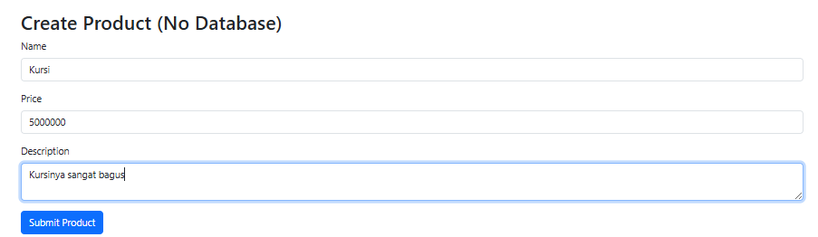
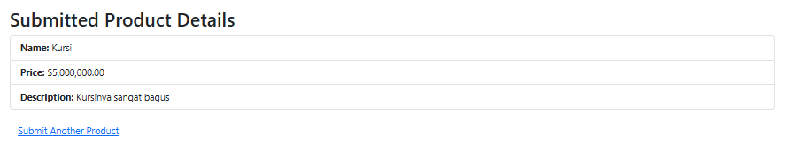
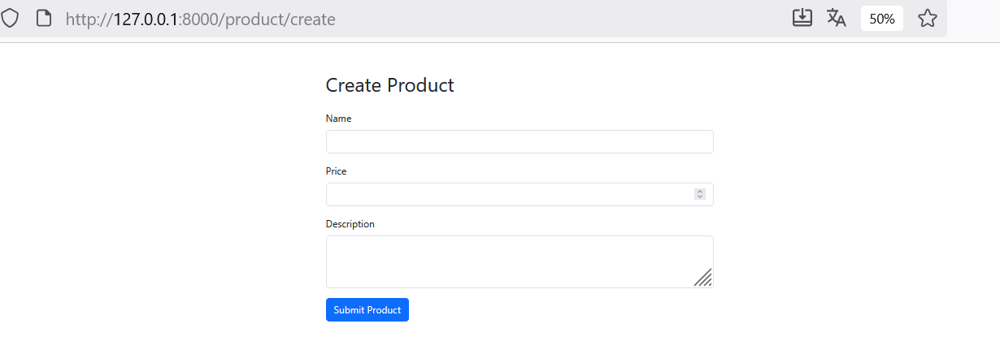
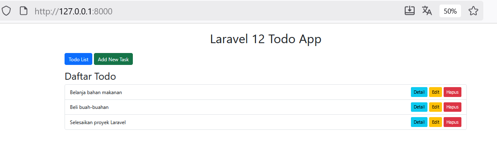

# **Laporan Modul 6: Model dan Laravel Eloquent**
**Mata Kuliah:** Workshop Web Lanjut
**Nama:** Lediana Berasa
**NIM:** 2024573010034
**Kelas:** TI2C

---

## **Abstrak**

Di laporan ini, saya akan membahas bagaimana cara kerja **Model dan Laravel Eloquent ORM** di Laravel 12. Tujuannya adalah untuk memahami bagaimana Laravel berkomunikasi dengan database melalui model, dan bagaimana kita bisa pakai Eloquent ORM untuk melakukan operasi database (tambah, baca, ubah, hapus) dengan cara yang lebih mudah. Selain itu, kita juga akan belajar tentang **POCO (Plain Old Class Object)**, **Data Transfer Object (DTO)**, dan **Repository Pattern** sebagai cara untuk memisahkan logika bisnis dengan akses data. Hasil praktikum menunjukkan bahwa Eloquent bikin kita ngelola database jadi lebih gampang dan efisien, plus membantu kita bikin aplikasi yang lebih rapi, modular, dan gampang dirawat.

---

## **1. Dasar Teori**

* **Model di Laravel**
  Model itu kayak jembatan antara aplikasi kita dan database. Setiap model biasanya terhubung dengan satu tabel di database. Laravel pakai **Eloquent ORM (Object-Relational Mapping)** biar kita bisa ngobrol sama database pakai objek PHP tanpa harus nulis SQL yang ribet.

* **Eloquent ORM**
  Eloquent itu alat dari Laravel yang bikin kita bisa berinteraksi dengan tabel database pakai model tanpa harus nulis query SQL manual. Operasi kayak **tambah data**, **baca data**, **ubah data**, dan **hapus data (CRUD)** bisa dilakukan dengan cara yang lebih sederhana dan intuitif.

* **POCO (Plain Old Class Object)**
  POCO itu kelas PHP biasa yang kita pakai buat nyimpen data tanpa harus ketergantungan sama Laravel. Biasanya dipakai buat simulasi model atau entitas tapi nggak perlu koneksi ke database.

* **Data Transfer Object (DTO)**
  DTO itu kelas yang kita pakai buat pindahin data antar bagian di aplikasi kita, misalnya dari **Controller** ke **Service Layer**. Tujuannya biar logika bisnis dan data mentah (biasanya dari request) bisa dipisah dengan jelas.

* **Repository Pattern**
  Repository pattern itu kayak lapisan pemisah antara model dan logika bisnis. Pola ini bikin kode kita lebih gampang diuji dan diatur dengan cara memisahkan logika akses data dari controller.

* **Migration dan Seeder**
  Migration itu buat ngatur struktur database pakai kode PHP, sedangkan Seeder itu buat ngisi data awal ke database.

---

## **2. Langkah-Langkah Praktikum**

### **2.1 Praktikum 1 – Menggunakan Model POCO (Tanpa Database)**

1. Pertama, bikin project baru:

   ```
   laravel new model-app
   cd model-app
   ```
2. Terus, bikin folder `app/ViewModels` dan file `ProductViewModel.php`.
3. Isi file `ProductViewModel.php`:

   ```php
   namespace App\ViewModels;

   class ProductViewModel
   {
       public string $name;
       public float $price;
       public string $description;

       public function __construct(string $name = '', float $price = 0, string $description = '')
       {
           $this->name = $name;
           $this->price = $price;
           $this->description = $description;
       }

       public static function fromRequest(array $data): self
       {
           return new self(
               $data['name'] ?? '',
               (float)($data['price'] ?? 0),
               $data['description'] ?? ''
           );
       }
   }
   ```
4. Bikin controller `ProductController`:

   ```bash
   php artisan make:controller ProductController
   ```

   Terus tambahin method `create()` dan `result()` buat ngatur form input dan hasilnya.
5. Tambahin route di `routes/web.php`:

   ```php
   Route::get('/product/create', [ProductController::class, 'create'])->name('product.create');
   Route::post('/product/result', [ProductController::class, 'result'])->name('product.result');
   ```
6. Bikin view:

   * `resources/views/product/create.blade.php` → form input produk
   * `resources/views/product/result.blade.php` → nampilin hasil input
7. Jalankan aplikasi dengan `php artisan serve` dan buka `http://localhost:8000/product/create`.

**Hasil:**
 -  
 -  
Form produk bisa nampilin data input dan hasilnya tanpa harus konek ke database.

---

### **2.2 Praktikum 2 – Menggunakan Data Transfer Object (DTO)**

1. Bikin folder `app/DTO` dan file `ProductDTO.php`.
2. Isi file:

   ```php
   namespace App\DTO;

   class ProductDTO
   {
       public function __construct(
           public string $name,
           public float $price,
           public string $description
       ) {}

       public static function fromRequest(array $data): self
       {
           return new self(
               $data['name'] ?? '',
               (float)($data['price'] ?? 0),
               $data['description'] ?? ''
           );
       }
   }
   ```
3. Bikin service layer `app/Services/ProductService.php`:

   ```php
   namespace App\Services;

   use App\DTO\ProductDTO;

   class ProductService
   {
       public function display(ProductDTO $product): array
       {
           return [
               'name' => $product->name,
               'price' => $product->price,
               'description' => $product->description,
           ];
       }
   }
   ```
4. Edit `ProductController` biar pake DTO dan Service:

   ```php
   public function result(Request $request)
   {
       $dto = ProductDTO::fromRequest($request->all());
       $service = new ProductService();
       $product = $service->display($dto);
       return view('product.result', compact('product'));
   }
   ```
5. Bikin view yang nampilin data dari DTO.
6. Jalankan aplikasi dan coba input data produk.

**Hasil:**
 -  
DTO berhasil dipakai buat pindahin data antar lapisan aplikasi dengan arsitektur yang lebih rapi.

---

### **2.3 Praktikum 3 – Aplikasi Todo CRUD Menggunakan Eloquent ORM**

1. Bikin project baru:

   ```
   laravel new todo-app-mysql
   ```

2. Atur koneksi database MySQL di file `.env`:

   ```
   DB_CONNECTION=mysql
   DB_HOST=127.0.0.1
   DB_PORT=3306
   DB_DATABASE=tododb
   DB_USERNAME=root
   DB_PASSWORD=
   ```

3. Bikin migration:

   ```bash
   php artisan make:migration create_todos_table
   ```

   Isi dengan struktur tabel `todos`:

   ```php
   $table->id();
   $table->string('task');
   $table->boolean('completed')->default(false);
   $table->timestamps();
   ```

   Jalankan `php artisan migrate`.

4. Bikin seeder `TodoSeeder` dan tambahin data dummy pakai `DB::table('todos')->insert([...])`, lalu jalankan:

   ```bash
   php artisan db:seed --class=TodoSeeder
   ```

5. Bikin model `Todo`:

   ```bash
   php artisan make:model Todo
   ```

   Tambahin properti:

   ```php
   protected $fillable = ['task', 'completed'];
   ```

6. Bikin controller:

   ```bash
   php artisan make:controller TodoController
   ```

   Tambahin fungsi CRUD (index, create, store, edit, update, destroy).

7. Bikin views:

   * `todos/index.blade.php` buat nampilin daftar tugas
   * `todos/create.blade.php` buat nambah tugas

8. Jalankan aplikasi dengan `php artisan serve`.

**Hasil:**

Aplikasi Todo bisa melakukan operasi CRUD penuh dengan MySQL pakai Eloquent ORM.

---

## **3. Hasil dan Pembahasan**

* Aplikasi Todo berhasil nampilin daftar tugas dari database, nambah data baru, ubah status, dan hapus tugas dengan sukses.
* Pake **Eloquent ORM** bikin interaksi database jadi lebih gampang dan efisien tanpa harus nulis SQL manual.
* Di praktikum DTO dan POCO, data bisa diproses tanpa harus konek ke database, nunjukin kalau Laravel itu fleksibel dalam ngatur berbagai skenario arsitektur.
* Kesalahan umum kayak validasi input yang kosong bisa dicegah pakai `$request->validate()` di controller.

---

## **4. Kesimpulan**

Dari praktikum ini, bisa disimpulin bahwa:

1. **Model** itu jembatan antara aplikasi dan database.
2. **Eloquent ORM** bikin ngelola data jadi lebih gampang dengan pendekatan berorientasi objek.
3. **POCO** dan **DTO** bisa dipakai buat ngelola data secara terstruktur tanpa harus ketergantungan langsung ke database.
4. **Repository Pattern** bantu pisahin logika bisnis dan akses data, jadi kode jadi lebih modular dan gampang diuji.
5. Praktikum ini bikin kita makin paham gimana Laravel implementasiin arsitektur **MVC** secara penuh dengan lapisan model yang kuat.

---

## **5. Referensi**

* Laravel Documentation — [https://laravel.com/docs](https://laravel.com/docs)
* Tutorial Laravel Eloquent ORM – IlmuData
* OnPHPID – "Laravel Validasi Input dan Error Handling"
* Materi Workshop Web Lanjut (Google Share)
* Materi Workshop Web Lanjut (HackMD) — Muhammad Reza Zulman

---
