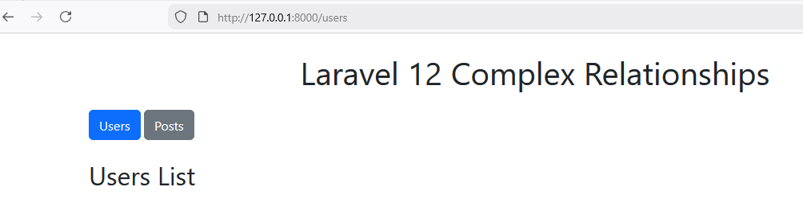

# Laporan Modul 7: Eloquent Relationship & Pagination

**Mata Kuliah:** Workshop Web Lanjut   
**Nama:** [Lediana Berasa]  
**NIM:** [2024573010034]  
**Kelas:** [TI2C]  

---

## Abstrak 

Laporan praktikum ini membahas penerapan Eloquent Relationship dan Pagination dalam framework Laravel. Tujuan utamanya adalah untuk memahami bagaimana mendefinisikan hubungan antar tabel database dengan mudah menggunakan Eloquent ORM serta mengimplementasikan pagination untuk meningkatkan performa dan pengalaman pengguna. Metode yang digunakan dalam praktikum ini meliputi pembuatan project Laravel baru, pembuatan model dan migrasi untuk berbagai jenis relasi (One-to-One, One-to-Many, Many-to-Many), pembuatan seeder untuk data dummy, implementasi controller dan view untuk menampilkan data dengan relasi, serta implementasi pagination pada data yang besar. Hasil praktikum menunjukkan pemahaman yang baik tentang konsep relasi database di Laravel dan kemampuan dalam mengimplementasikan pagination untuk meningkatkan performa aplikasi web.

---

## 1. Dasar Teori

### Eloquent Relationship
Eloquent relationship menyediakan cara yang mudah untuk mendefinisikan hubungan antara tabel database dan model di Laravel. Ini adalah fitur penting dari framework Laravel dan menjadi salah satu keunggulan utamanya. Eloquent relationship membantu menghubungkan data antar tabel dengan cara yang sederhana dan mudah dipahami, tanpa perlu menulis query SQL yang rumit.

#### One-to-One
Jenis relationship ini digunakan ketika satu data dari sebuah model hanya bisa berhubungan dengan satu data dari model lain. Contoh kasus: hubungan antara user dan profile. Seorang user hanya bisa memiliki satu profile, dan satu profile hanya bisa dimiliki oleh satu user saja.

#### One-to-Many
Dalam relationship satu ke banyak, satu data dari sebuah model bisa berhubungan dengan satu atau lebih data dari model lain. Contoh kasus: hubungan antara category dan post. Satu kategori bisa memiliki banyak post, tapi satu post hanya bisa dimiliki oleh satu kategori.

#### Many-to-Many
Relationship ini menggambarkan hubungan dimana satu atau lebih data dari sebuah model bisa berhubungan dengan satu atau lebih data dari model lain. Contoh kasus: Dalam platform manajemen sekolah, banyak siswa bisa mendaftar ke banyak mata kuliah, dan banyak mata kuliah bisa dipelajari oleh banyak siswa. Untuk hubungan ini diperlukan tabel pivot (tabel perantara) yang menyimpan hubungan antara kedua model.

### Pagination
Pagination adalah teknik untuk mengatur konten di website dengan membaginya menjadi beberapa halaman berurutan, biasanya ditandai dengan nomor atau tombol navigasi. Tujuan utamanya adalah untuk meningkatkan pengalaman pengguna dan performa aplikasi dengan tidak menampilkan semua data dalam satu halaman.

#### Mengapa Paginasi Penting?
- **Pengalaman Pengguna yang Lebih Baik:** Membantu pengguna menemukan informasi dengan cepat tanpa membuat mereka kewalahan dengan data yang terlalu banyak.
- **Peningkatan Performa:** Hanya memuat sebagian data, sehingga meningkatkan waktu loading dan kinerja aplikasi secara keseluruhan.
- **Manfaat SEO:** Mengorganisir konten untuk pengindeksan yang lebih baik oleh mesin pencari.
- **Optimasi Mobile:** Mengurangi kebutuhan scrolling berlebihan pada perangkat mobile.

#### Cara Kerja Pagination di Laravel
Laravel menyediakan metode `paginate()` yang memudahkan implementasi pagination. Metode ini secara otomatis menangani logika pembagian halaman, mengoptimalkan query, dan menyediakan navigasi halaman. Data yang tersedia di view meliputi:
- `$products->items()` - Data produk di halaman saat ini
- `$products->links()` - HTML untuk navigasi paginasi
- `$products->currentPage()` - Halaman saat ini
- `$products->total()` - Total semua produk
- `$products->perPage()` - Jumlah item per halaman

---

## 2. Langkah-Langkah Praktikum

### Praktikum 1 - Eloquent ORM Relationships: One-to-One, One-to-Many, Many-to-Many

#### Langkah 1: Buat dan Buka Proyek Laravel
1. Membuat proyek Laravel baru dengan perintah:
   ```
   laravel new complex-relationships
   cd complex-relationships
   code .
   ```
2. Menginstal dependency MySQL:
   ```
   composer require doctrine/dbal
   ```
3. Membuat database baru dengan nama `eloquentrelation_db` melalui phpMyAdmin.
4. Mengkonfigurasi koneksi database di file .env:
   ```
   DB_CONNECTION=mysql
   DB_HOST=127.0.0.1
   DB_PORT=3306
   DB_DATABASE=eloquentrelation_db
   DB_USERNAME=root
   DB_PASSWORD=
   ```
5. Membersihkan config cache:
   ```
   php artisan config:clear
   ```

#### Langkah 2: Buat Migrasi untuk Skema Database
1. Membuat migrasi untuk tabel-tabel yang dibutuhkan:
   ```
   php artisan make:migration create_profiles_table
   php artisan make:migration create_posts_table
   php artisan make:migration create_tags_table
   php artisan make:migration create_post_tag_table
   ```
2. Mengedit file migrasi untuk tabel profiles:
   ```php
   return new class extends Migration {
       public function up()
       {
           Schema::create('profiles', function (Blueprint $table) {
               $table->id();
               $table->unsignedBigInteger('user_id')->unique();
               $table->text('bio')->nullable();
               $table->string('website')->nullable();
               $table->timestamps();

               $table->foreign('user_id')->references('id')->on('users')->onDelete('cascade');
           });
       }

       public function down()
       {
           Schema::dropIfExists('profiles');
       }
   };
   ```
3. Mengedit file migrasi untuk tabel posts:
   ```php
   return new class extends Migration {
       public function up()
       {
           Schema::create('posts', function (Blueprint $table) {
               $table->id();
               $table->unsignedBigInteger('user_id');
               $table->string('title');
               $table->text('content');
               $table->timestamps();

               $table->foreign('user_id')->references('id')->on('users')->onDelete('cascade');
           });
       }

       public function down()
       {
           Schema::dropIfExists('posts');
       }
   };
   ```
4. Mengedit file migrasi untuk tabel tags:
   ```php
   return new class extends Migration {
       public function up()
       {
           Schema::create('tags', function (Blueprint $table) {
               $table->id();
               $table->string('name')->unique();
               $table->timestamps();
           });
       }

       public function down()
       {
           Schema::dropIfExists('tags');
       }
   };
   ```
5. Mengedit file migrasi untuk tabel post_tag (tabel pivot):
   ```php
   return new class extends Migration {
       public function up()
       {
           Schema::create('post_tag', function (Blueprint $table) {
               $table->id();
               $table->unsignedBigInteger('post_id');
               $table->unsignedBigInteger('tag_id');
               $table->timestamps();

               $table->foreign('post_id')->references('id')->on('posts')->onDelete('cascade');
               $table->foreign('tag_id')->references('id')->on('tags')->onDelete('cascade');
           });
       }

       public function down()
       {
           Schema::dropIfExists('post_tag');
       }
   };
   ```
6. Menjalankan migrasi:
   ```
   php artisan migrate
   ```

#### Langkah 3: Mendefinisikan Model Eloquent
1. Membuat model untuk tabel-tabel yang dibutuhkan:
   ```
   php artisan make:model Profile
   php artisan make:model Post
   php artisan make:model Tag
   ```
2. Mengedit model User untuk menyertakan relasi dengan Profile dan Post:
   ```php
   use App\Models\Profile;
   use App\Models\Post;

   class User extends Model
   {
       /**
        * Relasi One-to-One dengan Profile
        */
       public function profile()
       {
           return $this->hasOne(Profile::class);
       }

       /**
        * Relasi One-to-Many dengan Post
        */
       public function posts()
       {
           return $this->hasMany(Post::class);
       }
   }
   ```
3. Mengedit model Profile:
   ```php
   use Illuminate\Database\Eloquent\Model;
   use Illuminate\Database\Eloquent\Factories\HasFactory;
   use App\Models\User;

   class Profile extends Model
   {
       use HasFactory;

       protected $fillable = ['user_id', 'bio', 'website'];

       /**
        * Relasi inverse One-to-One dengan User
        */
       public function user()
       {
           return $this->belongsTo(User::class);
       }
   }
   ```
4. Mengedit model Post:
   ```php
   use Illuminate\Database\Eloquent\Model;
   use Illuminate\Database\Eloquent\Factories\HasFactory;
   use App\Models\User;
   use App\Models\Tag;

   class Post extends Model
   {
       use HasFactory;

       protected $fillable = ['user_id', 'title', 'content'];

       /**
        * Relasi inverse One-to-Many dengan User
        */
       public function user()
       {
           return $this->belongsTo(User::class);
       }

       /**
        * Relasi Many-to-Many dengan Tag
        */
       public function tags()
       {
           return $this->belongsToMany(Tag::class);
       }
   }
   ```
5. Mengedit model Tag:
   ```php
   use Illuminate\Database\Eloquent\Model;
   use Illuminate\Database\Eloquent\Factories\HasFactory;
   use App\Models\Post;

   class Tag extends Model
   {
       use HasFactory;

       protected $fillable = ['name'];

       /**
        * Relasi Many-to-Many dengan Post
        */
       public function posts()
       {
           return $this->belongsToMany(Post::class);
       }
   }
   ```

#### Langkah 4: Membuat Seeder
1. Mengedit file database/seeders/DatabaseSeeder.php:
   ```php
   use App\Models\User;
   use App\Models\Profile;
   use App\Models\Post;
   use App\Models\Tag;

   public function run(): void
   {
       // Membuat 10 user menggunakan factory
       User::factory(10)->create();

       // Membuat profile untuk setiap user
       foreach (User::all() as $user) {
           $user->profile()->create([
               'bio' => 'Ini adalah bio untuk user ' . $user->id,
               'website' => 'https://example.com/user/' . $user->id,
           ]);
       }

       // Membuat post untuk setiap user
       foreach (User::all() as $user) {
           $user->posts()->create([
               'title' => 'Judul Post untuk user ' . $user->id,
               'content' => 'Ini adalah konten dari post untuk user ' . $user->id,
           ]);
       }

       // Membuat tag dan mengasosiasikannya dengan posts
       foreach (Post::all() as $post) {
           $tag = Tag::create(['name' => 'Tag untuk post ' . $post->id]);
           $post->tags()->attach($tag->id);
       }        
   }
   ```
2. Menjalankan seeder:
   ```
   php artisan db:seed
   ```

#### Langkah 5: Membuat Controller
1. Membuat controller:
   ```
   php artisan make:controller UserController
   php artisan make:controller PostController
   ```
2. Mengedit UserController:
   ```php
   <?php

   namespace App\Http\Controllers;

   use Illuminate\Http\Request;
   use App\Models\User;

   class UserController extends Controller
   {
       /**
        * Menampilkan daftar semua user dengan profile dan posts terkait
        */
       public function index()
       {
           $users = User::with('profile', 'posts')->get();
           return view('users.index', compact('users'));
       }

       /**
        * Menampilkan detail user tertentu
        */
       public function show(User $user)
       {
           return view('users.show', compact('user'));
       }
   }
   ```
3. Mengedit PostController:
   ```php
   <?php

   namespace App\Http\Controllers;

   use Illuminate\Http\Request;
   use App\Models\Post;

   class PostController extends Controller
   {
       /**
        * Menampilkan daftar semua posts dengan user dan tags terkait
        */
       public function index()
       {
           $posts = Post::with('user', 'tags')->get();
           return view('posts.index', compact('posts'));
       }

       /**
        * Menampilkan detail post tertentu
        */
       public function show(Post $post)
       {
           return view('posts.show', compact('post'));
       }
   }
   ```

#### Langkah 6: Mendefinisikan Web Routes
1. Mengedit file routes/web.php:
   ```php
   <?php

   use Illuminate\Support\Facades\Route;
   use App\Http\Controllers\UserController;
   use App\Http\Controllers\PostController;

   // Routes untuk User
   Route::get('/users', [UserController::class, 'index'])->name('users.index');
   Route::get('/users/{user}', [UserController::class, 'show'])->name('users.show');

   // Routes untuk Post
   Route::get('/posts', [PostController::class, 'index'])->name('posts.index');
   Route::get('/posts/{post}', [PostController::class, 'show'])->name('posts.show');
   ```

#### Langkah 7: Membuat Views Menggunakan Bootstrap
1. Membuat folder layouts di resources/views dan membuat file resources/views/layouts/app.blade.php:
   ```html
   <!DOCTYPE html>
   <html lang="en">
   <head>
       <meta charset="UTF-8">
       <meta name="viewport" content="width=device-width, initial-scale=1.0">
       <title>@yield('title')</title>
       <link href="https://cdn.jsdelivr.net/npm/bootstrap@5.3.3/dist/css/bootstrap.min.css" rel="stylesheet">
   </head>
   <body class="container mt-4">

       <h1 class="text-center mb-4">Laravel Complex Relationships</h1>

       @if(session('success'))
           <div class="alert alert-success">{{ session('success') }}</div>
       @endif

       <nav class="mb-4">
           <a href="{{ route('users.index') }}" class="btn btn-primary">Users</a>
           <a href="{{ route('posts.index') }}" class="btn btn-secondary">Posts</a>
       </nav>

       @yield('content')

   </body>
   </html>
   ```
2. Membuat folder users di resources/views dan membuat file resources/views/users/index.blade.php:
   ```html
   @extends('layouts.app')

   @section('title', 'Users')

   @section('content')
       <h2>Users List</h2>
       <ul class="list-group">
           @foreach($users as $user)
               <li class="list-group-item">
                   <a href="{{ route('users.show', $user->id) }}">{{ $user->name }}</a> ({{ $user->email }})
               </li>
           @endforeach
       </ul>
   @endsection
   ```
3. Membuat file resources/views/users/show.blade.php:
   ```html
   @extends('layouts.app')

   @section('title', 'User Profile')

   @section('content')
       <h2>{{ $user->name }}'s Profile</h2>
       <p>Email: {{ $user->email }}</p>

       <h3>Profile Details</h3>
       <p>Bio: {{ $user->profile->bio ?? 'No bio available' }}</p>
       <p>Website: <a href="{{ $user->profile->website ?? '#' }}">{{ $user->profile->website ?? 'No website' }}</a></p>

       <h3>Posts</h3>
       <ul class="list-group">
           @foreach($user->posts as $post)
               <li class="list-group-item">
                   <a href="{{ route('posts.show', $post->id) }}">{{ $post->title }}</a>
               </li>
           @endforeach
       </ul>
   @endsection
   ```
4. Membuat folder posts di resources/views dan membuat file resources/views/posts/index.blade.php:
   ```html
   @extends('layouts.app')

   @section('title', 'Posts')

   @section('content')
       <h2>All Posts</h2>

       <ul class="list-group">
           @foreach($posts as $post)
               <li class="list-group-item">
                   <a href="{{ route('posts.show', $post->id) }}">{{ $post->title }}</a> by {{ $post->user->name }}
               </li>
           @endforeach
       </ul>
   @endsection
   ```
5. Membuat file resources/views/posts/show.blade.php:
   ```html
   @extends('layouts.app')

   @section('title', 'Post Details')

   @section('content')
       <h2>{{ $post->title }}</h2>
       <p><strong>Author:</strong> {{ $post->user->name }}</p>
       <p>{{ $post->content }}</p>

       <h3>Tags</h3>
       <ul class="list-group">
           @foreach($post->tags as $tag)
               <li class="list-group-item">{{ $tag->name }}</li>
           @endforeach
       </ul>

       <a href="{{ route('posts.index') }}" class="btn btn-secondary mt-3">Back to Posts</a>
   @endsection
   ```

#### Langkah 8: Testing Aplikasi
1. Menjalankan server development Laravel:
   ```
   php artisan serve
   ```
2. Mengakses aplikasi melalui browser:
   

### Praktikum 2 - Paginasi dengan Eloquent ORM

#### Langkah 1: Membuat Proyek Laravel Baru
1. Membuat proyek Laravel baru:
   ```
   laravel new productpagination
   cd productpagination
   code .
   ```
2. Menginstal dependency MySQL:
   ```
   composer require doctrine/dbal
   ```
3. Membuat database baru dengan nama `pagination_db` melalui phpMyAdmin.
4. Mengkonfigurasi koneksi database di file .env:
   ```
   DB_CONNECTION=mysql
   DB_HOST=127.0.0.1
   DB_PORT=3306
   DB_DATABASE=pagination_db
   DB_USERNAME=root
   DB_PASSWORD=
   ```
5. Membersihkan config cache:
   ```
   php artisan config:clear
   ```

#### Langkah 2: Membuat Model dan Migrasi Product
1. Membuat model Product dan migrasi:
   ```
   php artisan make:model Product -m
   ```
2. Mengedit file migrasi database/migrations/xxxx_create_products_table.php:
   ```php
   public function up(): void
   {
       Schema::create('products', function (Blueprint $table) {
           $table->id();
           $table->string('name');
           $table->decimal('price', 10, 2);
           $table->timestamps();
       });
   }
   ```
3. Menjalankan migrasi:
   ```
   php artisan migrate
   ```

#### Langkah 3: Membuat Seeder untuk Data Dummy
1. Mengedit model Product di app/Models/Product.php:
   ```php
   <?php

   namespace App\Models;

   use Illuminate\Database\Eloquent\Model;
   use Illuminate\Database\Eloquent\Factories\HasFactory;

   class Product extends Model
   {
       use HasFactory;

       protected $fillable = ['name', 'price'];
   }
   ```
2. Membuat factory untuk model Product:
   ```
   php artisan make:factory ProductFactory --model=Product
   ```
3. Mengedit file database/factories/ProductFactory.php:
   ```php
   namespace Database\Factories;

   use Illuminate\Database\Eloquent\Factories\Factory;

   class ProductFactory extends Factory
   {
       public function definition(): array
       {
           return [
               'name' => fake()->word(),
               'price' => fake()->randomFloat(2, 10, 1000),
           ];
       }
   }
   ```
4. Membuat seeder:
   ```
   php artisan make:seeder ProductSeeder
   ```
5. Mengedit file database/seeders/ProductSeeder.php:
   ```php
   namespace Database\Seeders;

   use Illuminate\Database\Seeder;
   use App\Models\Product;

   class ProductSeeder extends Seeder
   {
       public function run(): void
       {
           Product::factory()->count(50)->create();
       }
   }
   ```
6. Mengedit file database/seeders/DatabaseSeeder.php:
   ```php
   public function run(): void
   {
       $this->call([
           ProductSeeder::class,
       ]);
   }
   ```
7. Menjalankan seeder:
   ```
   php artisan db:seed
   ```

#### Langkah 4: Membuat Controller untuk Paginasi
1. Membuat controller:
   ```
   php artisan make:controller ProductController
   ```
2. Mengedit file app/Http/Controllers/ProductController.php:
   ```php
   namespace App\Http\Controllers;

   use App\Models\Product;

   class ProductController extends Controller
   {
       public function index()
       {
           $products = Product::orderBy('id', 'desc')->paginate(10);
           return view('products.index', compact('products'));
       }
   }
   ```

#### Langkah 5: Mendefinisikan Route
1. Mengedit file routes/web.php:
   ```php
   use App\Http\Controllers\ProductController;

   Route::get('/products', [ProductController::class, 'index'])->name('products.index');
   ```

#### Langkah 6: Membuat View untuk Daftar Produk dengan Paginasi
1. Membuat folder products di resources/views dan membuat file resources/views/products/index.blade.php:
   ```html
   <!DOCTYPE html>
   <html>
   <head>
       <title>Paginated Products</title>
       <script src="https://cdn.tailwindcss.com"></script>
   </head>
   <body class="max-w-4xl mx-auto py-10">
       <h1 class="text-2xl font-bold mb-5">Daftar Produk (Paginasi)</h1>

       <table class="table-auto w-full border-collapse border border-gray-300 mb-6">
           <thead>
               <tr class="bg-gray-200">
                   <th class="border px-4 py-2">#</th>
                   <th class="border px-4 py-2">Nama</th>
                   <th class="border px-4 py-2">Harga</th>
               </tr>
           </thead>
           <tbody>
               @foreach ($products as $product)
               <tr>
                   <td class="border px-4 py-2">{{ $product->id }}</td>
                   <td class="border px-4 py-2">{{ $product->name }}</td>
                   <td class="border px-4 py-2">${{ number_format($product->price, 2) }}</td>
               </tr>
               @endforeach
           </tbody>
       </table>

       <div>
           {{ $products->links() }}
       </div>
   </body>
   </html>
   ```

#### Langkah 7: Menjalankan dan Menguji
1. Menjalankan server development Laravel:
   ```
   php artisan serve
   ```
2. Mengakses aplikasi melalui browser:
  

---

## 3. Hasil dan Pembahasan

### Hasil Praktikum 1 - Eloquent ORM Relationships
Aplikasi berjalan sesuai harapan dengan baik. Semua jenis relasi (One-to-One, One-to-Many, Many-to-Many) berhasil diimplementasikan dengan benar. Halaman users menampilkan daftar pengguna yang dapat diklik untuk melihat detail profil dan postingan mereka. Halaman posts menampilkan daftar postingan dengan informasi penulis dan tag yang terkait.

Beberapa poin penting dari hasil praktikum:
1. Relasi One-to-One antara User dan Profile berfungsi dengan baik, setiap user memiliki satu profil yang unik.
2. Relasi One-to-Many antara User dan Posts berhasil diimplementasikan, setiap user dapat memiliki banyak postingan.
3. Relasi Many-to-Many antara Posts dan Tags berfungsi dengan baik melalui tabel pivot post_tag.
4. Data dummy yang dibuat melalui seeder berhasil menampilkan relasi dengan benar.

### Hasil Praktikum 2 - Paginasi dengan Eloquent ORM
Aplikasi pagination berjalan sesuai harapan. Data produk berhasil ditampilkan dengan pagination 10 item per halaman. Navigasi pagination berfungsi dengan baik dan menggunakan styling Tailwind CSS yang disediakan oleh Laravel.

Beberapa poin penting dari hasil praktikum:
1. Pagination berhasil meningkatkan performa aplikasi dengan tidak memuat semua data sekaligus.
2. Tampilan pagination responsif dan mudah digunakan.
3. Data produk ditampilkan dengan format yang rapi dan terstruktur.

### Pembahasan
1. **Keuntungan Eloquent Relationships**: Eloquent Relationships memudahkan pengembang untuk mendefinisikan hubungan antar tabel tanpa perlu menulis query SQL yang kompleks. Hal ini membuat kode lebih bersih, mudah dibaca, dan mudah dipelihara.

2. **Pentingnya Inverse Relationship**: Inverse relationship (hubungan balik) sangat membantu dalam mengakses data dari kedua arah. Misalnya, kita bisa mengambil data user dari profile dan profile dari user, atau mengambil data category dari post dan posts dari category.

3. **Pentingnya Pagination**: Pagination sangat penting untuk aplikasi yang menangani data dalam jumlah besar. Tanpa pagination, aplikasi akan memuat semua data sekaligus yang dapat menyebabkan masalah performa dan pengalaman pengguna yang buruk.

4. **Tantangan yang Dihadapi**: 
   - Pada praktikum relasi, tantangan utama adalah memahami konsep tabel pivot untuk relasi Many-to-Many.
   - Pada praktikum pagination, tantangan adalah mengatur styling agar tampilan pagination menarik dan responsif.

5. **Penamaan yang Konsisten**: Penamaan method dan variabel yang konsisten sangat penting dalam implementasi Eloquent Relationships. Misalnya, method posts() (jamak) untuk relasi One-to-Many dan method post() (tunggal) untuk relasi belongsTo.

---

## 4. Kesimpulan

Dari praktikum ini, saya mendapatkan pemahaman yang lebih baik tentang dua konsep fundamental dalam pengembangan aplikasi Laravel, yaitu Eloquent Relationship dan Pagination.

Eloquent Relationship memungkinkan developer untuk mendefinisikan hubungan antar tabel database dengan cara yang intuitif dan mudah dipahami, tanpa harus menulis query SQL yang kompleks. Saya berhasil mempraktikkan tiga jenis relationship utama: One-to-One (hubungan user dan profile), One-to-Many (hubungan user dan posts), serta Many-to-Many (hubungan posts dan tags) yang memerlukan tabel pivot.

Di sisi lain, praktikum pagination mengajarkan saya bagaimana mengimplementasikan teknik penting untuk mengelola penampilan data dalam jumlah besar. Pagination tidak hanya meningkatkan pengalaman pengguna dengan menghindari penampilan data yang berlebihan dalam satu halaman, tetapi juga meningkatkan performa aplikasi dengan memuat hanya sebagian data yang diperlukan.

Kedua konsep ini—Eloquent Relationship dan Pagination—merupakan keterampilan esensial yang sangat berguna dalam pengembangan aplikasi Laravel yang skalabel dan efisien. Saya sekarang lebih siap untuk menghadapi tantangan dalam membangun aplikasi web yang kompleks dengan Laravel.

---

## 5. Referensi
1. Laravel Documentation - Eloquent Relationships
   https://laravel.com/docs/eloquent-relationships

2. Laravel Documentation - Pagination
   https://laravel.com/docs/pagination

3. Laravel Eloquent Relationships Tutorial
   https://www.digitalocean.com/community/tutorials/how-to-use-eloquent-orm-in-laravel

4. Laravel Pagination Tutorial
   https://laravel-news.com/paginating-records-with-laravel

5. Materi Workshop Web Lanjut (Google Share)
   https://share.google/FcFzL3VQU36QE8MrM\